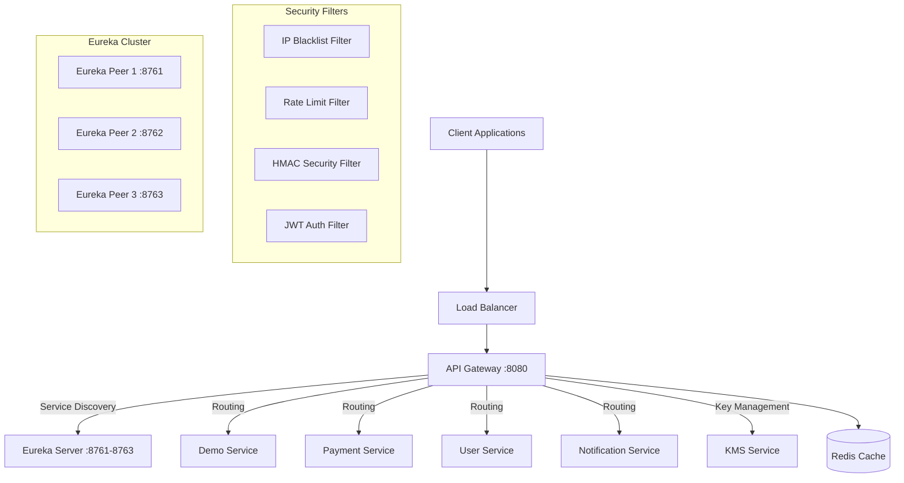
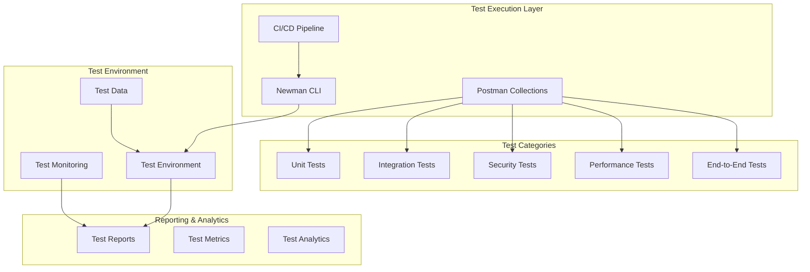

# Design Document: Comprehensive Postman Testing Strategy

## Overview

Thiết kế này mô tả một chiến lược testing toàn diện sử dụng Postman để kiểm tra hệ thống microservices phức tạp bao gồm API Gateway, Eureka Server, KMS, và các microservices. Hệ thống có nhiều lớp bảo mật (JWT, HMAC, IP blacklist, rate limiting) và yêu cầu testing đa chiều từ unit test đến integration test và performance test.

Chiến lược này được thiết kế để đảm bảo:
- **Chất lượng**: Mỗi service hoạt động đúng chức năng
- **Bảo mật**: Tất cả security filters được kiểm tra kỹ lưỡng
- **Hiệu suất**: Hệ thống đáp ứng được yêu cầu về performance
- **Tích hợp**: Các services tương tác chính xác với nhau
- **Tự động hóa**: Tests có thể chạy trong CI/CD pipeline

## Architecture

### System Architecture Overview



### Test Architecture Design



## Components and Interfaces

### 1. Test Collection Structure

#### 1.1 Individual Service Collections
- **API Gateway Collection**: Tests cho routing, filters, và gateway functionality
- **Eureka Server Collection**: Tests cho service discovery và cluster management
- **Demo Service Collection**: Tests cho basic CRUD operations
- **Payment Service Collection**: Tests cho payment processing workflows
- **User Service Collection**: Tests cho user management và authentication
- **Notification Service Collection**: Tests cho notification delivery
- **KMS Collection**: Tests cho key management và encryption

#### 1.2 Security Test Collections
- **JWT Authentication Tests**: Validation của JWT tokens và authorization
- **HMAC Security Tests**: Verification của HMAC signatures và nonce handling
- **IP Blacklist Tests**: Testing của IP blocking functionality
- **Rate Limiting Tests**: Validation của rate limiting mechanisms
- **Header Sanitization Tests**: Testing của input sanitization

#### 1.3 Integration Test Collections
- **Service Discovery Integration**: Tests cho Eureka registration/deregistration
- **Cross-Service Workflows**: End-to-end business process tests
- **Transaction Management**: Tests cho distributed transaction handling
- **Error Propagation**: Tests cho error handling across services

#### 1.4 Performance Test Collections
- **Load Testing**: Concurrent user simulation
- **Stress Testing**: System behavior under extreme load
- **Throughput Testing**: API Gateway performance measurement
- **Latency Testing**: Response time validation

### 2. Test Environment Management

#### 2.1 Environment Configuration
```javascript
// Environment Variables Structure
{
  "api_gateway_url": "http://localhost:8080",
  "eureka_server_url": "http://localhost:8761",
  "demo_service_url": "http://localhost:8081",
  "payment_service_url": "http://localhost:8082",
  "user_service_url": "http://localhost:8083",
  "notification_service_url": "http://localhost:8084",
  "kms_service_url": "http://localhost:8085",
  "redis_host": "localhost",
  "redis_port": "6379",
  "test_user_token": "{{jwt_token}}",
  "hmac_access_key": "{{access_key}}",
  "hmac_secret_key": "{{secret_key}}"
}
```

#### 2.2 Test Data Management
- **User Test Data**: Predefined users với different roles và permissions
- **Payment Test Data**: Mock payment scenarios và transaction data
- **Service Test Data**: Sample data cho mỗi service's entities
- **Security Test Data**: Valid/invalid tokens, keys, và signatures

### 3. Authentication & Security Testing Framework

#### 3.1 JWT Token Management
```javascript
// Pre-request Script for JWT
pm.test("Generate JWT Token", function () {
    const loginRequest = {
        url: pm.environment.get("api_gateway_url") + "/iam/user/login",
        method: 'POST',
        header: {
            'Content-Type': 'application/json',
            'X-HMAC-AccessKeyId': pm.environment.get("hmac_access_key"),
            'X-HMAC-Timestamp': Math.floor(Date.now() / 1000).toString(),
            'X-HMAC-Nonce': generateNonce(),
            'X-HMAC-Signature': generateHmacSignature()
        },
        body: {
            mode: 'raw',
            raw: JSON.stringify({
                username: "testuser",
                password: "testpass"
            })
        }
    };
    
    pm.sendRequest(loginRequest, function (err, response) {
        if (response.code === 200) {
            const token = response.json().data.token;
            pm.environment.set("jwt_token", token);
        }
    });
});
```

#### 3.2 HMAC Signature Generation
```javascript
// HMAC Signature Helper Functions
function generateNonce() {
    return Math.random().toString(36).substring(2, 15) + 
           Math.random().toString(36).substring(2, 15);
}

function generateHmacSignature(method, path, timestamp, nonce, bodyHash) {
    const canonicalString = `${method}\n${path}\n${timestamp}\n${nonce}\n${bodyHash}`;
    const secretKey = pm.environment.get("hmac_secret_key");
    return CryptoJS.HmacSHA256(canonicalString, secretKey).toString();
}

function hashContent(body) {
    return CryptoJS.SHA256(body || "").toString();
}
```

### 4. Test Execution Framework

#### 4.1 Newman Integration
```bash
# Newman execution với environment và reporting
newman run collection.json \
  --environment environment.json \
  --reporters cli,html,json \
  --reporter-html-export report.html \
  --reporter-json-export report.json \
  --iteration-count 1 \
  --delay-request 100
```

#### 4.2 Parallel Execution Strategy
- **Service-level parallelization**: Mỗi service collection chạy độc lập
- **Test-type parallelization**: Unit, integration, security tests chạy song song
- **Environment isolation**: Mỗi parallel run sử dụng isolated test data

## Data Models

### 1. Test Result Data Model
```json
{
  "testRun": {
    "id": "uuid",
    "timestamp": "2024-01-01T00:00:00Z",
    "environment": "test|staging|production",
    "collection": "collection-name",
    "status": "passed|failed|skipped",
    "duration": 1500,
    "stats": {
      "total": 100,
      "passed": 95,
      "failed": 5,
      "skipped": 0
    }
  },
  "testCases": [
    {
      "id": "test-case-id",
      "name": "Test Case Name",
      "status": "passed|failed|skipped",
      "duration": 150,
      "assertions": [
        {
          "name": "Status code is 200",
          "passed": true,
          "message": ""
        }
      ],
      "request": {
        "method": "GET",
        "url": "http://localhost:8080/api/endpoint",
        "headers": {},
        "body": ""
      },
      "response": {
        "status": 200,
        "headers": {},
        "body": "",
        "responseTime": 150
      }
    }
  ]
}
```

### 2. Service Health Data Model
```json
{
  "serviceHealth": {
    "serviceName": "api-gateway",
    "status": "UP|DOWN|DEGRADED",
    "timestamp": "2024-01-01T00:00:00Z",
    "checks": [
      {
        "name": "database-connection",
        "status": "UP",
        "details": {
          "database": "PostgreSQL",
          "validationQuery": "SELECT 1"
        }
      },
      {
        "name": "external-service",
        "status": "UP",
        "responseTime": "150ms"
      }
    ],
    "metrics": {
      "responseTime": 150,
      "throughput": 1000,
      "errorRate": 0.01
    }
  }
}
```

### 3. Security Test Data Model
```json
{
  "securityTest": {
    "testType": "jwt|hmac|rate-limit|ip-blacklist",
    "scenario": "valid-token|invalid-token|expired-token|missing-token",
    "input": {
      "headers": {},
      "body": "",
      "parameters": {}
    },
    "expectedResult": {
      "statusCode": 401,
      "errorMessage": "Invalid token",
      "securityHeaders": ["X-Content-Type-Options", "X-Frame-Options"]
    },
    "actualResult": {
      "statusCode": 401,
      "responseBody": "",
      "headers": {},
      "responseTime": 50
    }
  }
}
```

### 4. Performance Test Data Model
```json
{
  "performanceTest": {
    "testType": "load|stress|spike|volume",
    "configuration": {
      "concurrentUsers": 100,
      "duration": "5m",
      "rampUpTime": "30s",
      "targetThroughput": 1000
    },
    "metrics": {
      "averageResponseTime": 150,
      "p95ResponseTime": 300,
      "p99ResponseTime": 500,
      "throughput": 950,
      "errorRate": 0.02,
      "cpuUsage": 75,
      "memoryUsage": 60
    },
    "thresholds": {
      "maxResponseTime": 500,
      "maxErrorRate": 0.05,
      "minThroughput": 800
    }
  }
}
```

### 5. Test Environment Data Model
```json
{
  "testEnvironment": {
    "name": "test-env-1",
    "services": [
      {
        "name": "api-gateway",
        "url": "http://localhost:8080",
        "status": "running",
        "version": "1.0.0"
      },
      {
        "name": "eureka-server",
        "url": "http://localhost:8761",
        "status": "running",
        "version": "1.0.0"
      }
    ],
    "testData": {
      "users": [
        {
          "username": "testuser1",
          "password": "testpass1",
          "roles": ["USER"]
        }
      ],
      "tokens": {
        "validJwt": "eyJ...",
        "expiredJwt": "eyJ...",
        "invalidJwt": "invalid"
      },
      "hmacKeys": {
        "accessKey": "test-access-key",
        "secretKey": "test-secret-key"
      }
    }
  }
}
```
## Correctness Properties

*A property is a characteristic or behavior that should hold true across all valid executions of a system-essentially, a formal statement about what the system should do. Properties serve as the bridge between human-readable specifications and machine-verifiable correctness guarantees.*

### Property Reflection Analysis

After analyzing all acceptance criteria, I identified several areas where properties can be consolidated to eliminate redundancy:

**Consolidated Security Properties**: Properties 2.1, 2.2, 2.3 can be combined into a comprehensive security validation property since they all test authentication/authorization failures.

**Consolidated Service Health Properties**: Properties 1.1, 1.2, 1.5 can be combined into a comprehensive service health validation property.

**Consolidated Integration Properties**: Properties 4.1, 4.2, 4.4, 4.5 can be combined into a comprehensive cross-service integration property.

**Consolidated Performance Properties**: Properties 5.1, 5.2, 5.3, 5.4, 5.5 can be combined into a comprehensive performance validation property.

### Property 1: Comprehensive Service Health Validation

*For any* service in the system (API_Gateway, Eureka_Server, KMS, Demo_Service, Payment_Service, User_Service, Notification_Service), the test suite should include health check tests that validate response status codes, headers, body structure, and response times under 500ms for simple operations.

**Validates: Requirements 1.1, 1.2, 1.5**

### Property 2: CRUD Operations Coverage

*For any* service's main entities, the test suite should include comprehensive CRUD (Create, Read, Update, Delete) operation tests that validate all basic data manipulation functionality.

**Validates: Requirements 1.3**

### Property 3: Error Handling Validation

*For any* invalid input provided to any service endpoint, the test suite should verify that proper error responses and error codes are returned and validated.

**Validates: Requirements 1.4**

### Property 4: Comprehensive Security Filter Validation

*For any* security-protected endpoint, when requests are sent without proper authentication (missing JWT, invalid JWT, missing HMAC, invalid HMAC), from blacklisted IPs, or exceeding rate limits, the test suite should verify appropriate security responses (401, 403, 429) and security mechanisms.

**Validates: Requirements 2.1, 2.2, 2.3, 2.4, 2.5**

### Property 5: Security Injection Prevention

*For any* input field or endpoint, the test suite should include tests for header sanitization, SQL injection prevention, and XSS vulnerability prevention.

**Validates: Requirements 2.6, 8.1, 8.2**

### Property 6: Service Discovery Integration

*For any* service in the system, the test suite should verify service registration with Eureka Server, validate service metadata and health status, test deregistration when services go down, and validate load balancing across service instances.

**Validates: Requirements 3.1, 3.2, 3.3, 3.4**

### Property 7: Eureka Dashboard Accessibility

*For any* Eureka dashboard access attempt, the test suite should validate dashboard accessibility and authentication mechanisms.

**Validates: Requirements 3.5**

### Property 8: Cross-Service Integration Validation

*For any* multi-service workflow (such as payment processing involving User_Service and Notification_Service), the test suite should include end-to-end tests that verify service integration, transaction rollback scenarios, KMS key usage across services, and data consistency across service boundaries.

**Validates: Requirements 4.1, 4.2, 4.3, 4.4, 4.5**

### Property 9: Comprehensive Performance Testing

*For any* system under load (minimum 100 concurrent requests), the test suite should monitor response times and error rates, test API Gateway throughput and bottleneck identification, validate system behavior under stress conditions, and verify graceful degradation when memory or CPU usage is high.

**Validates: Requirements 5.1, 5.2, 5.3, 5.4, 5.5**

### Property 10: Test Data Management

*For any* test execution, the test suite should include setup scripts for test data creation, automatically clean up test data when tests complete, use environment variables for different test environments, include data generators for realistic test scenarios, and prevent data conflicts when tests run in parallel.

**Validates: Requirements 6.1, 6.2, 6.3, 6.4, 6.5**

### Property 11: Test Automation and CI/CD Integration

*For any* test suite execution, it should be executable via Newman command line, automatically trigger when code is committed, generate detailed test reports in multiple formats (HTML, JSON, JUnit), notify relevant teams when tests fail, and support parallel test execution for faster feedback.

**Validates: Requirements 7.1, 7.2, 7.3, 7.4, 7.5**

### Property 12: Authentication and Session Management Security

*For any* authentication token expiration scenario, the test suite should verify proper session management, test for sensitive data exposure in responses, and validate HTTPS enforcement and certificate validation.

**Validates: Requirements 8.3, 8.4, 8.5**

### Property 13: Monitoring and Alerting Integration

*For any* test execution, the test suite should integrate with monitoring tools to track test metrics, trigger alerts to operations team when critical tests fail, collect and report system metrics during test execution, validate monitoring endpoints and health checks, and execute diagnostic tests when system anomalies are detected.

**Validates: Requirements 9.1, 9.2, 9.3, 9.4, 9.5**

### Property 14: Documentation and Maintenance Completeness

*For any* test collection in the test suite, it should include comprehensive documentation, provide setup and execution instructions for new team members, maintain version history and change logs when tests are updated, include troubleshooting guides for common test failures, and provide templates for adding new test cases.

**Validates: Requirements 10.1, 10.2, 10.3, 10.4, 10.5**

## Error Handling

### 1. Test Execution Error Handling

#### 1.1 Network Connectivity Issues
- **Timeout Handling**: Tests should handle network timeouts gracefully với configurable timeout values
- **Connection Failures**: Retry mechanisms cho failed connections với exponential backoff
- **DNS Resolution**: Fallback mechanisms khi service discovery fails

#### 1.2 Service Unavailability
- **Circuit Breaker Pattern**: Tests should detect và handle service outages
- **Graceful Degradation**: Continue testing available services khi một số services down
- **Health Check Failures**: Proper error reporting khi health checks fail

#### 1.3 Authentication and Authorization Errors
- **Token Expiration**: Automatic token refresh mechanisms
- **Permission Denied**: Clear error messages và proper test categorization
- **HMAC Signature Failures**: Detailed error reporting cho signature validation issues

### 2. Test Data Error Handling

#### 2.1 Data Consistency Issues
- **Concurrent Access**: Handle data conflicts trong parallel test execution
- **Data Corruption**: Validation mechanisms để detect corrupted test data
- **Cleanup Failures**: Rollback mechanisms khi cleanup scripts fail

#### 2.2 Environment Configuration Errors
- **Missing Environment Variables**: Clear error messages và validation
- **Invalid Configuration**: Configuration validation trước khi run tests
- **Environment Mismatch**: Detection và handling của environment inconsistencies

### 3. Performance Test Error Handling

#### 3.1 Resource Exhaustion
- **Memory Limits**: Graceful handling khi system runs out of memory
- **CPU Overload**: Test throttling mechanisms để prevent system overload
- **Disk Space**: Monitoring và cleanup của test artifacts

#### 3.2 Load Test Failures
- **Target Unreachable**: Fallback strategies khi load targets cannot be met
- **Metric Collection Failures**: Alternative monitoring approaches
- **Test Infrastructure Overload**: Auto-scaling mechanisms cho test infrastructure

## Testing Strategy

### 1. Dual Testing Approach

Chiến lược testing sử dụng kết hợp của **Unit Tests** và **Property-Based Tests** để đảm bảo coverage toàn diện:

#### Unit Tests Focus:
- **Specific Examples**: Test các scenarios cụ thể với known inputs và expected outputs
- **Edge Cases**: Test boundary conditions và special cases
- **Integration Points**: Test interactions giữa các components
- **Error Conditions**: Test specific error scenarios và exception handling

#### Property-Based Tests Focus:
- **Universal Properties**: Test các properties phải hold true across all inputs
- **Comprehensive Input Coverage**: Sử dụng randomization để test với wide range of inputs
- **Invariant Validation**: Ensure system invariants are maintained across all operations
- **Regression Prevention**: Catch regressions that might not be covered by specific unit tests

### 2. Property-Based Testing Configuration

#### 2.1 Testing Library Selection
- **JavaScript/Newman**: Sử dụng `fast-check` library cho property-based testing trong Postman pre-request và test scripts
- **Minimum Iterations**: Mỗi property test phải run minimum **100 iterations** để ensure adequate coverage
- **Randomization Seed**: Configurable seeds để ensure reproducible test runs

#### 2.2 Property Test Implementation
```javascript
// Example Property Test Implementation
pm.test("Property 1: Service Health Validation", function () {
    // Tag: Feature: comprehensive-postman-testing-strategy, Property 1: Service health validation
    const services = ["api-gateway", "eureka-server", "demo-service", "payment-service"];
    
    services.forEach(service => {
        const healthEndpoint = pm.environment.get(service + "_url") + "/health";
        
        pm.sendRequest({
            url: healthEndpoint,
            method: 'GET'
        }, function (err, response) {
            // Validate response status codes, headers, and body structure
            pm.expect(response.code).to.be.oneOf([200, 503]);
            pm.expect(response.headers.get('Content-Type')).to.include('application/json');
            pm.expect(response.responseTime).to.be.below(500);
            
            if (response.code === 200) {
                const body = response.json();
                pm.expect(body).to.have.property('status');
                pm.expect(body.status).to.be.oneOf(['UP', 'DOWN', 'DEGRADED']);
            }
        });
    });
});
```

#### 2.3 Test Tagging Strategy
Mỗi property-based test phải được tag với format:
```
Feature: comprehensive-postman-testing-strategy, Property {number}: {property_description}
```

### 3. Test Execution Strategy

#### 3.1 Sequential vs Parallel Execution
- **Service-Level Parallelization**: Các service collections có thể run parallel
- **Security Tests**: Run sequentially để avoid interference với security filters
- **Performance Tests**: Run in isolated environments để ensure accurate metrics
- **Integration Tests**: Coordinate execution để ensure proper service state

#### 3.2 Environment Management
- **Test Environment Isolation**: Mỗi test run sử dụng isolated test data
- **Configuration Management**: Environment-specific configurations cho different test stages
- **Resource Cleanup**: Automatic cleanup sau mỗi test execution cycle

#### 3.3 Continuous Integration Integration
```yaml
# CI/CD Pipeline Configuration Example
test_stages:
  - name: unit_tests
    parallel: true
    collections: ["service_unit_tests"]
    
  - name: security_tests
    parallel: false
    collections: ["security_tests"]
    depends_on: ["unit_tests"]
    
  - name: integration_tests
    parallel: true
    collections: ["integration_tests"]
    depends_on: ["security_tests"]
    
  - name: performance_tests
    parallel: false
    collections: ["performance_tests"]
    depends_on: ["integration_tests"]
    environment: "performance_test_env"
```

### 4. Reporting and Metrics

#### 4.1 Test Report Generation
- **HTML Reports**: Detailed visual reports cho manual review
- **JSON Reports**: Machine-readable reports cho automated processing
- **JUnit Reports**: Integration với CI/CD systems và test management tools

#### 4.2 Metrics Collection
- **Test Coverage Metrics**: Track coverage của different test categories
- **Performance Metrics**: Response times, throughput, error rates
- **Security Metrics**: Security test pass rates, vulnerability detection rates
- **Reliability Metrics**: Test stability, flakiness detection

#### 4.3 Alerting and Notifications
- **Critical Test Failures**: Immediate notifications cho critical system failures
- **Performance Degradation**: Alerts khi performance thresholds are exceeded
- **Security Issues**: Priority alerts cho security test failures
- **Trend Analysis**: Regular reports về test trends và system health