# HR Microservices - Architecture, Use Case, CDM and ERD Models

Tai lieu nay tong hop cac mo hinh thiet ke chinh cua du an HR Microservices dua tren code hien tai trong cac service: `api-gateway`, `auth-service`, `hr-service`, `project-service`, `task-service`, `kms`, va `eureka-server`.

> Ghi chu: du an theo kien truc microservices, moi service nen so huu database rieng. Cac quan he giua `auth_user_id`, `employee_id`, `project_id`, `assignee_id`, `lead_id` la tham chieu logic qua API/event, khong phai foreign key vat ly giua database.

## 1. Kien Truc Tong The

### 1.1 System Context

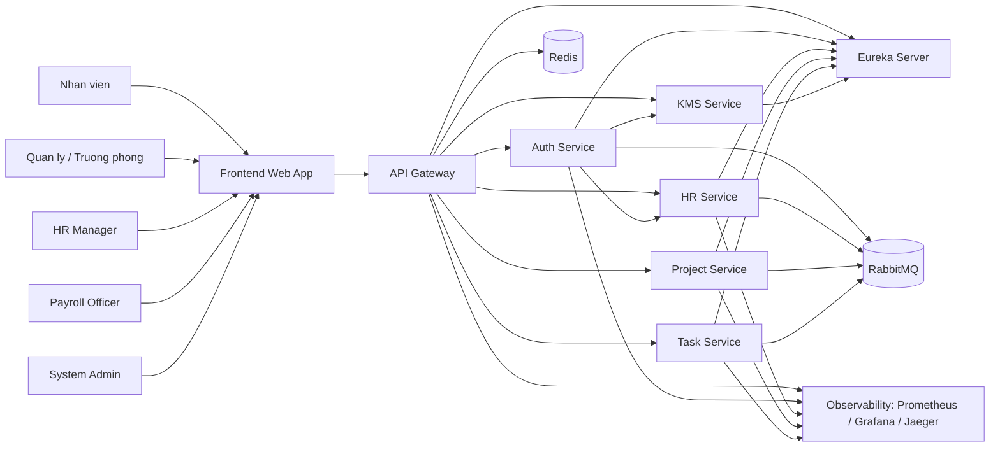

### 1.2 Container / Service Model

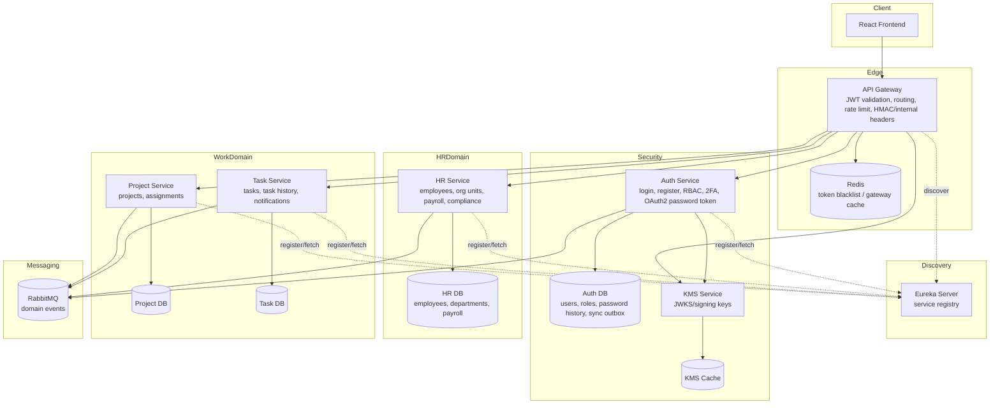

### 1.3 Service Responsibility Matrix

| Service | Trach nhiem chinh | Du lieu so huu | Tich hop |
|---|---|---|---|
| `api-gateway` | Dinh tuyen API, kiem tra JWT, cache blacklist token, bo sung internal secret, route legacy Vietnamese path | Khong so huu domain data | KMS JWKS, Redis, Eureka |
| `auth-service` | Dang ky, dang nhap, OAuth2 token, 2FA, doi mat khau, khoa/mo tai khoan, quan tri user/role, sync user sang HR | User, RoleDefinition, PasswordHistory, UserSyncOutbox/DLQ | KMS, HR sync endpoint, RabbitMQ |
| `hr-service` | Ho so nhan vien, phong ban, don vi to chuc, payroll, payroll workflow, compliance report | Employee, Department, OrganizationUnit, Payroll*, Deduction*, TaxConfig | Auth sync, RabbitMQ events |
| `project-service` | Quan ly du an, lead, phan cong nhan vien vao du an | Project, ProjectAssignment | RabbitMQ project events |
| `task-service` | Quan ly cong viec, trang thai task, assignee, lich su, notification | Task, TaskHistory | Project events, notification adapter |
| `kms` | Quan ly khoa ky va JWKS cho JWT | Signing keys/cache | Gateway/Auth |
| `eureka-server` | Service discovery va registry replication | ServiceInstance/Lease logical data | Gateway va services |

## 2. Use Case Model

### 2.1 Actors

| Actor | Mo ta | Role lien quan |
|---|---|---|
| Nhan vien | Xem du an/cong viec duoc giao, doi mat khau, dang nhap/dang xuat | `USER`, `EMPLOYEE` |
| Quan ly | Theo doi du an, xem va quan ly phan cong trong pham vi quan ly | `MANAGER`, `DEPARTMENT_HEAD` |
| HR Manager | Quan ly nhan vien, phong ban, don vi to chuc, xem payroll | `HR_MANAGER`, `HR_ADMIN` |
| Payroll Officer | Phe duyet, tu choi, xu ly bang luong | `PAYROLL_OFFICER` |
| Admin | Quan tri tai khoan, vai tro, du an, task, cau hinh he thong | `ADMIN` |
| He thong ngoai / Scheduler | Goi sync/retry/event va cac tac vu nen | Internal service |

### 2.2 Use Case Diagram

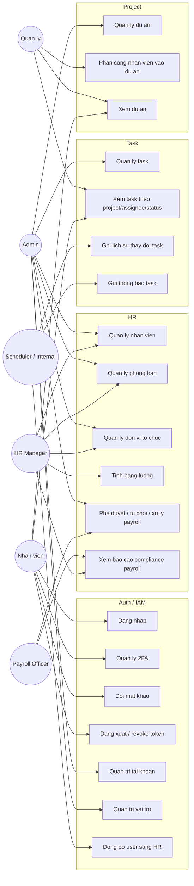

### 2.3 Use Case Summary

| Module | Use case | Trigger | Ket qua |
|---|---|---|---|
| Auth | Dang ky user | Admin/user submit username, password, role | Tao `users`, tao outbox sync sang HR |
| Auth | Dang nhap | Username/password/OTP | Tra JWT/OAuth2 token hoac yeu cau MFA |
| Auth | 2FA | Khoi tao/xac nhan/tat 2FA | Cap nhat secret va trang thai 2FA |
| Auth | Quan tri user/role | Admin | Them/sua/xoa user, khoa/mo tai khoan, role definitions |
| HR | Dong bo user | Auth retry/scheduler/internal call | Tao/cap nhat `Employee` theo `authUserId`, ghi `ProcessedSyncEvent` |
| HR | Quan ly nhan vien | HR/Admin | CRUD employee, gan department, publish employee hired event |
| HR | Payroll calculation | HR Admin | Tao `PayrollResult` draft theo ky luong |
| HR | Payroll workflow | Payroll Officer/Admin | DRAFT -> APPROVED -> PROCESSED hoac reject ve DRAFT |
| Project | Quan ly du an | Admin | CRUD `Project`, publish event khi tao/status change |
| Project | Phan cong du an | Admin/Manager | Tao/xoa `ProjectAssignment` theo employee |
| Task | Quan ly task | Admin | CRUD `Task`, publish task events |
| Task | Xem task | User/Admin | Loc task theo project, assignee, status |

## 3. Domain Model / CDM

### 3.1 Conceptual Domain Model

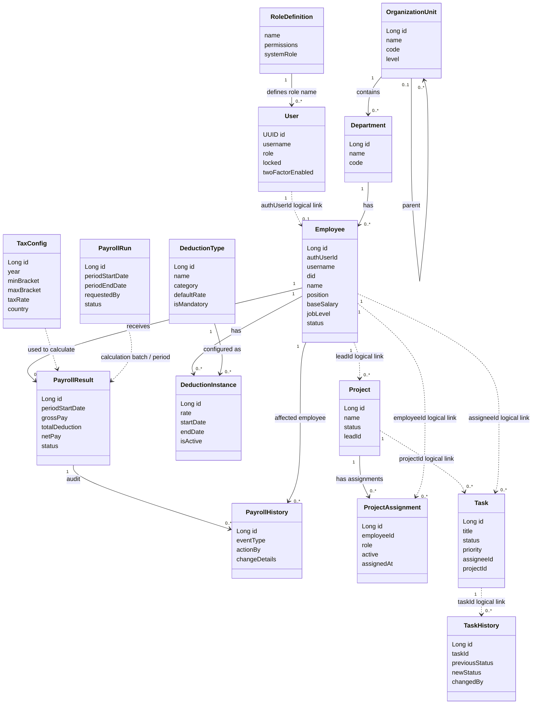

### 3.2 Bounded Contexts

| Bounded context | Aggregate / Entity chinh | Chu thich |
|---|---|---|
| Identity & Access | `User`, `RoleDefinition`, `UserPasswordHistory`, `UserSyncOutbox`, `UserSyncDlq` | Nguon su that ve tai khoan, role, MFA, password |
| HR Core | `Employee`, `Department`, `OrganizationUnit`, `ProcessedSyncEvent` | Nguon su that ve nhan vien va co cau to chuc |
| Payroll | `PayrollRun`, `PayrollResult`, `PayrollHistory`, `DeductionType`, `DeductionInstance`, `TaxConfig` | Tinh luong, phe duyet, xu ly, audit |
| Project Allocation | `Project`, `ProjectAssignment` | Quan ly du an va phan cong nhan su |
| Task Workflow | `Task`, `TaskHistory` | Quan ly cong viec, trang thai, assignee |
| Discovery / Edge | Service registry, gateway cache/security | Ha tang, khong phai domain nghiep vu chinh |

## 4. ERD

Trong bao cao tieng Viet, cac bang/cot SQL co the duoc trinh bay bang ten nghiep vu tieng Viet de de doc. Bang duoi day la bang doi chieu giua schema that trong code va ten tieng Viet dung trong mo hinh:

| Ten trong schema/code | Ten tieng Viet trong mo hinh |
|---|---|
| `users` | `NGUOI_DUNG` |
| `role_definitions` | `VAI_TRO` |
| `user_password_history` | `LICH_SU_MAT_KHAU` |
| `user_sync_outbox` | `HANG_DOI_DONG_BO_NGUOI_DUNG` |
| `user_sync_dlq` | `HANG_DOI_LOI_DONG_BO` |
| `organization_units` | `DON_VI_TO_CHUC` |
| `departments` | `PHONG_BAN` |
| `employee` / `employees` | `NHAN_VIEN` |
| `processed_sync_events` | `SU_KIEN_DONG_BO_DA_XU_LY` |
| `payroll_run` | `DOT_TINH_LUONG` |
| `payroll_result` | `KET_QUA_LUONG` |
| `payroll_history` | `LICH_SU_LUONG` |
| `deduction_type` | `LOAI_KHAU_TRU` |
| `deduction_instance` | `KHAU_TRU_NHAN_VIEN` |
| `tax_config` | `CAU_HINH_THUE` |
| `projects` | `DU_AN` |
| `project_assignments` | `PHAN_CONG_DU_AN` |
| `tasks` | `CONG_VIEC` |
| `task_history` | `LICH_SU_CONG_VIEC` |

Ghi chu: schema trong code van giu ten tieng Anh de dong bo voi entity JPA va migration/DDL hien co; ten tieng Viet chi dung cho tai lieu va so do trinh bay.

### 4.1 ERD Tong Hop Logic

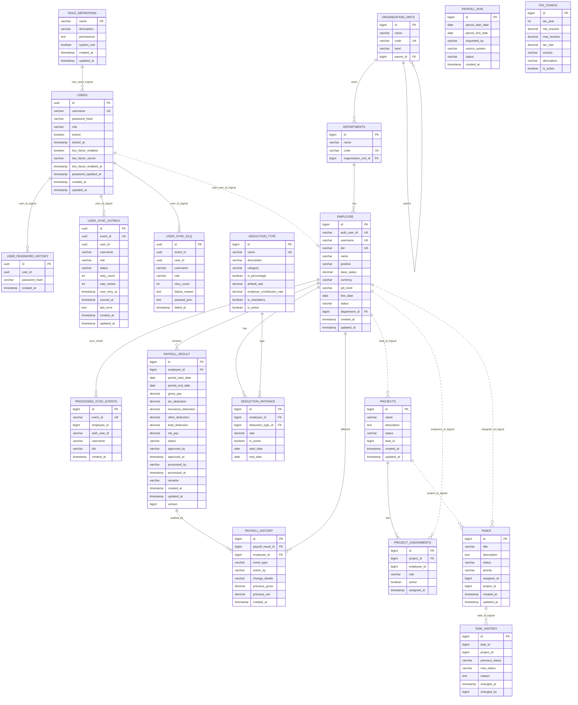

### 4.2 ERD Theo Tung Database

#### Auth DB

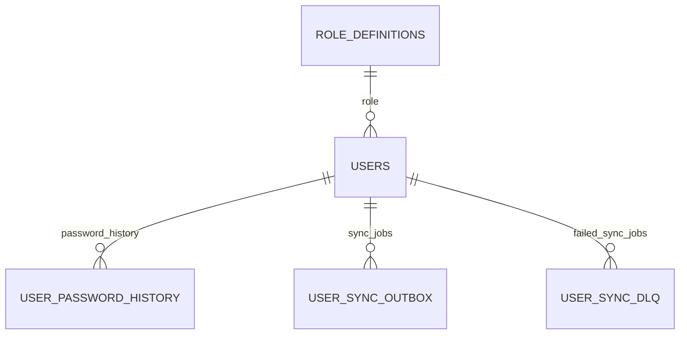

#### HR DB

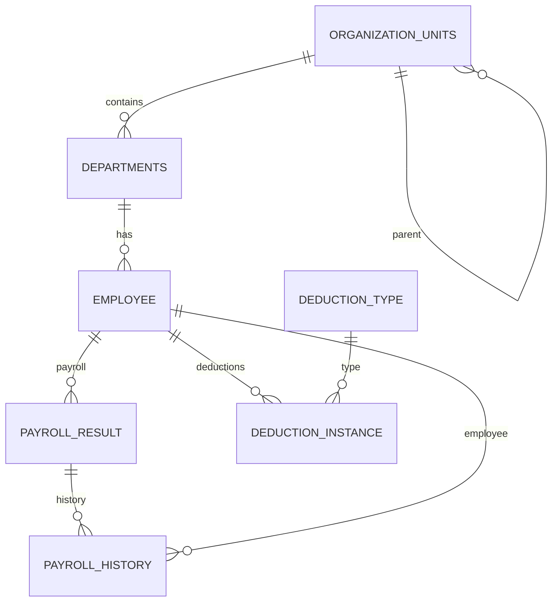

#### Project DB

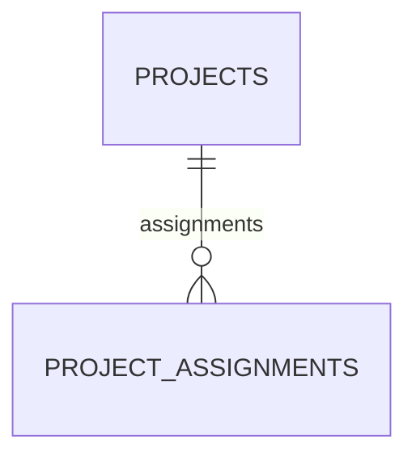

#### Task DB

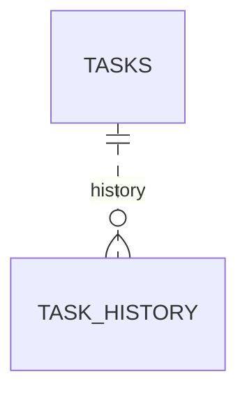

## 5. Sequence Models

### 5.1 Dang Nhap Va Goi API Bao Ve

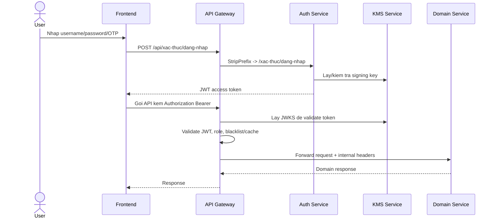

### 5.2 Dang Ky User Va Dong Bo Employee

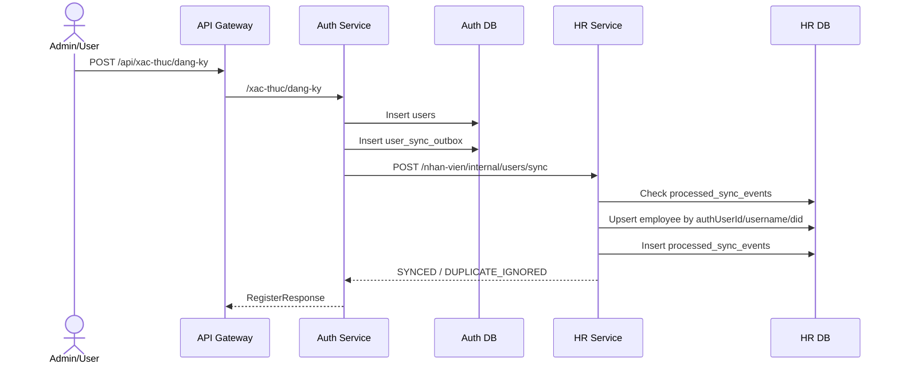

### 5.3 Payroll Workflow

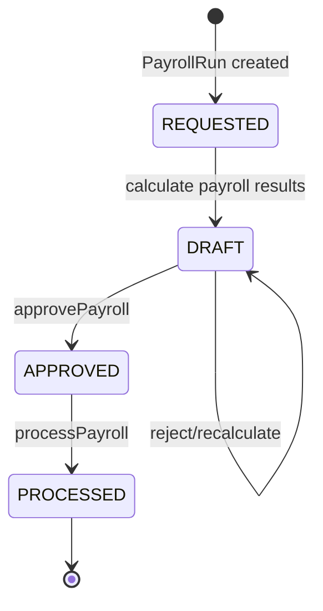

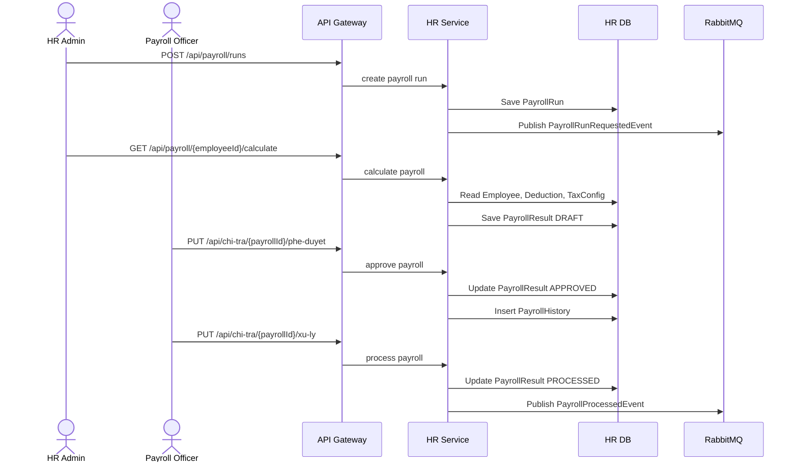

### 5.4 Project Va Task Flow

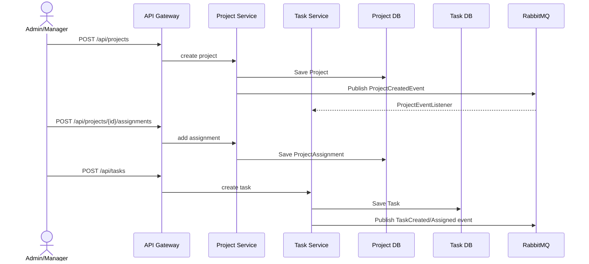

## 6. Security And RBAC Model

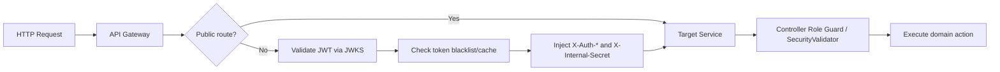

RBAC hien tai duoc ap dung o nhieu lop:

| Lop | Vi tri | Chuc nang |
|---|---|---|
| Gateway JWT | `api-gateway` | Xac thuc request bao ve, lay JWKS tu KMS |
| Internal secret | Gateway -> service | Dam bao request di qua gateway |
| Controller role annotation | `@RequiredRoles`, `@RequireRoles`, `@PreAuthorize` | Chan use case theo role |
| Domain validator | `SecurityValidator` trong HR | Kiem tra gateway access va role cho payroll/employee |

## 7. Ghi Chu Thiet Ke

1. `auth-service` la source of truth ve tai khoan va role; `hr-service` la source of truth ve nhan vien.
2. `Employee.authUserId` lien ket logic voi `User.id`, nhung khong nen tao FK cross-database.
3. `Project.leadId`, `ProjectAssignment.employeeId`, `Task.assigneeId` deu tham chieu logic den `Employee.id`.
4. `Task.projectId` tham chieu logic den `Project.id`.
5. Payroll can audit bang `PayrollHistory`; nen xem day la audit trail khong sua.
6. Cac event nhu `EmployeeHiredEvent`, `PayrollProcessedEvent`, `ProjectCreatedEvent`, `TaskCreatedEvent` giup giam coupling giua service.
7. `ProcessedSyncEvent` giup idempotency khi auth sync user sang HR.
