# BÁO CÁO KHÓA LUẬN TỐT NGHIỆP
## Đề tài: Phát triển hệ thống web quản lý nhân sự, bảng lương, dự án và công việc theo kiến trúc Microservices

---

# CHƯƠNG 1: MỞ ĐẦU / TỔNG QUAN ĐỀ TÀI

## 1.1. Lý do chọn đề tài

Trong bối cảnh chuyển đổi số mạnh mẽ, các doanh nghiệp không chỉ cần quản lý công việc theo dự án mà còn phải quản lý nhân sự, cơ cấu tổ chức, phân quyền truy cập và quy trình bảng lương một cách nhất quán. Khi số lượng nhân viên, phòng ban, dự án và tác vụ tăng lên, các hệ thống nguyên khối (Monolithic Architecture) dễ bộc lộ hạn chế về mở rộng, bảo trì, bảo mật và khả năng triển khai độc lập. Vì vậy, việc xây dựng một hệ thống HR Microservices có khả năng quản lý nhân viên, bảng lương, dự án và công việc là cần thiết trong môi trường doanh nghiệp hiện đại.

**1.1.1. Hạn chế của các hệ thống quản lý nhân sự và công việc truyền thống**

Các hệ thống quản lý nhân sự, bảng lương và công việc truyền thống, thường được phát triển theo kiến trúc nguyên khối, đối mặt với nhiều thách thức khi quy mô dữ liệu và số lượng người dùng tăng lên. Những hạn chế này bao gồm:

*   **Khó khăn trong việc mở rộng (Scalability):** Khi nhu cầu sử dụng tăng cao, việc mở rộng một ứng dụng nguyên khối thường đòi hỏi phải nhân bản toàn bộ hệ thống, dẫn đến lãng phí tài nguyên và chi phí vận hành cao. Việc mở rộng cục bộ cho từng thành phần chức năng là không khả thi.
*   **Tính sẵn sàng thấp (Low Availability):** Một lỗi nhỏ trong bất kỳ module nào của ứng dụng nguyên khối cũng có thể gây ảnh hưởng đến toàn bộ hệ thống, dẫn đến tình trạng ngừng hoạt động (downtime) và gián đoạn công việc.
*   **Phức tạp trong phát triển và bảo trì:** Mã nguồn của ứng dụng nguyên khối thường rất lớn và phức tạp, gây khó khăn cho việc phát triển tính năng mới, sửa lỗi và bảo trì. Sự phụ thuộc chặt chẽ giữa các module làm tăng rủi ro khi thay đổi, kéo dài chu kỳ phát hành sản phẩm.
*   **Hạn chế về công nghệ:** Các hệ thống nguyên khối thường bị ràng buộc bởi một bộ công nghệ duy nhất, gây khó khăn trong việc áp dụng các công nghệ mới, tối ưu hóa hiệu năng cho từng thành phần cụ thể.
*   **Thách thức về phân quyền và bảo mật:** Việc quản lý phân quyền chi tiết và đảm bảo bảo mật trong một hệ thống nguyên khối lớn có thể trở nên phức tạp, dễ phát sinh lỗ hổng khi hệ thống phát triển.

**1.1.2. Tính cấp thiết của việc ứng dụng kiến trúc Microservices**

Để khắc phục những hạn chế của kiến trúc truyền thống, việc ứng dụng kiến trúc Microservices cho hệ thống quản lý nhân sự, bảng lương, dự án và công việc trở nên cấp thiết. Kiến trúc Microservices mang lại nhiều lợi ích vượt trội, đáp ứng yêu cầu của một hệ thống hiện đại:

*   **Khả năng mở rộng linh hoạt (Flexible Scalability):** Mỗi dịch vụ có thể được mở rộng độc lập dựa trên nhu cầu thực tế, tối ưu hóa việc sử dụng tài nguyên và chi phí. Ví dụ, dịch vụ bảng lương có thể được mở rộng trong kỳ tính lương, trong khi dịch vụ dự án hoặc tác vụ vẫn vận hành độc lập.
*   **Tính sẵn sàng và chịu lỗi cao (High Availability and Fault Tolerance):** Các dịch vụ hoạt động độc lập, do đó, lỗi ở một dịch vụ sẽ không ảnh hưởng đến toàn bộ hệ thống. Cơ chế cách ly lỗi giúp duy trì hoạt động liên tục của các phần còn lại.
*   **Phát triển và triển khai độc lập (Independent Development and Deployment):** Mỗi dịch vụ có thể được phát triển, kiểm thử và triển khai độc lập, cho phép các nhóm phát triển làm việc song song, tăng tốc độ đưa sản phẩm ra thị trường (Time-to-Market).
*   **Linh hoạt công nghệ (Technology Heterogeneity):** Cho phép sử dụng các công nghệ, ngôn ngữ lập trình và cơ sở dữ liệu khác nhau cho từng dịch vụ, giúp lựa chọn công cụ phù hợp nhất cho từng bài toán cụ thể.
*   **Tối ưu hóa quản lý và bảo mật:** Kiến trúc Microservices tạo điều kiện thuận lợi cho việc triển khai các cơ chế bảo mật tinh vi như JWT (JSON Web Token) và phân quyền RBAC (Role-Based Access Control) ở cấp độ dịch vụ, tăng cường tính bảo mật tổng thể của hệ thống.

Từ những phân tích trên, việc xây dựng một hệ thống quản lý nhân sự, bảng lương, dự án và công việc dựa trên kiến trúc Microservices không chỉ giải quyết các vấn đề tồn đọng của phương pháp truyền thống mà còn tạo ra một nền tảng vững chắc, linh hoạt và hiệu quả, đáp ứng được yêu cầu phát triển bền vững trong môi trường kinh doanh hiện đại.

## 1.2. Mục tiêu nghiên cứu và phạm vi áp dụng

### 1.2.1. Mục tiêu nghiên cứu

**Mục tiêu tổng quát:**

Xây dựng thành công một ứng dụng web HR Microservices phục vụ quản lý tài khoản, nhân viên, phòng ban, đơn vị tổ chức, bảng lương, dự án và tác vụ. Hệ thống hướng đến việc cung cấp một nền tảng quản trị nội bộ có khả năng mở rộng, bảo mật và dễ triển khai cho doanh nghiệp vừa và nhỏ.

**Mục tiêu cụ thể:**

*   **Thiết kế và triển khai kiến trúc Microservices:** Xây dựng hệ thống với các dịch vụ độc lập, có khả năng giao tiếp thông qua API Gateway và cơ chế Service Discovery (Eureka Server).
*   **Phát triển các module chức năng cốt lõi:** Bao gồm xác thực và phân quyền, quản lý nhân viên, phòng ban, đơn vị tổ chức, bảng lương, dự án, tác vụ và thông báo sự kiện.
*   **Đảm bảo tính bảo mật và phân quyền:** Triển khai cơ chế xác thực JWT (JSON Web Token), 2FA, OAuth2 password token và phân quyền RBAC (Role-Based Access Control) cho các vai trò như `USER`, `EMPLOYEE`, `MANAGER`, `DEPARTMENT_HEAD`, `HR_MANAGER`, `HR_ADMIN`, `PAYROLL_OFFICER`, `ADMIN`.
*   **Tối ưu hóa hiệu năng và khả năng mở rộng:** Sử dụng Redis để caching dữ liệu thường xuyên truy cập, giảm tải cho cơ sở dữ liệu chính và cải thiện thời gian phản hồi (Response Time) của hệ thống.
*   **Đóng gói và triển khai dễ dàng:** Ứng dụng Docker để container hóa các dịch vụ, đảm bảo môi trường phát triển và triển khai đồng nhất, đơn giản hóa quá trình vận hành.

### 1.2.2. Phạm vi áp dụng

**Đối tượng áp dụng:**

Hệ thống được thiết kế để phục vụ các doanh nghiệp vừa và nhỏ (SMEs) có nhu cầu quản lý nhân sự nội bộ, cơ cấu phòng ban, bảng lương, phân bổ nhân sự vào dự án và theo dõi tác vụ theo dự án.

**Phạm vi chức năng (Những gì hệ thống SẼ LÀM):**

*   **Quản lý người dùng và vai trò:** Đăng ký, đăng nhập, đổi mật khẩu, 2FA, khóa/mở tài khoản, quản trị vai trò và đồng bộ tài khoản sang hồ sơ nhân viên.
*   **Quản lý nhân sự:** Quản lý nhân viên, phòng ban, đơn vị tổ chức và liên kết logic giữa tài khoản xác thực với hồ sơ nhân viên.
*   **Quản lý bảng lương:** Tính lương, cấu hình khấu trừ/thuế, phê duyệt, từ chối, xử lý bảng lương và ghi lịch sử kiểm toán.
*   **Quản lý dự án:** Tạo, chỉnh sửa, xóa dự án; phân công nhân viên vào dự án và xác định người phụ trách dự án.
*   **Quản lý tác vụ (Task Management):** Tạo, gán, cập nhật trạng thái và mức ưu tiên cho tác vụ; lọc tác vụ theo dự án, người được giao và trạng thái.
*   **Hệ thống thông báo và sự kiện:** Gửi thông báo tự động về các sự kiện quan trọng như tác vụ mới, thay đổi trạng thái tác vụ, dự án mới hoặc payroll đã xử lý.
*   **Xác thực và phân quyền:** Đảm bảo chỉ những người dùng có quyền hạn phù hợp mới có thể truy cập và thực hiện các thao tác trên hệ thống.

**Giới hạn chức năng (Những gì hệ thống KHÔNG LÀM):**

*   Hệ thống không thay thế phần mềm kế toán tổng hợp hoặc hệ thống ERP đầy đủ.
*   Không hỗ trợ các tính năng giao tiếp thời gian thực phức tạp như chat trực tuyến hay video call.
*   Chưa tối ưu hóa cho các doanh nghiệp có quy mô rất lớn (trên 1000 người dùng) hoặc các ngành nghề đặc thù yêu cầu các quy trình nghiệp vụ rất phức tạp (ví dụ: y tế, tài chính ngân hàng).

## 1.3. Đối tượng nghiên cứu và phương pháp thực hiện

### 1.3.1. Đối tượng nghiên cứu

Đối tượng nghiên cứu của đề tài bao gồm:

*   **Quy trình quản lý nhân sự, bảng lương, dự án và công việc:** Phân tích các quy trình hiện tại, xác định các điểm nghẽn và đề xuất giải pháp tối ưu hóa thông qua ứng dụng phần mềm.
*   **Kiến trúc Microservices:** Nghiên cứu sâu về các nguyên tắc thiết kế, mô hình triển khai, ưu nhược điểm và các mẫu thiết kế (design patterns) phổ biến trong kiến trúc Microservices.
*   **Các công nghệ triển khai hệ thống:** Tập trung vào Java 21, Spring Boot, Spring Cloud Gateway, Eureka Server, JWT/JWKS, PostgreSQL, MySQL, Redis, RabbitMQ, Docker và bộ công cụ quan sát Prometheus/Grafana/Jaeger. Nghiên cứu cách tích hợp và tối ưu hóa các công nghệ này để xây dựng một hệ thống hoạt động hiệu quả và ổn định.
*   **Các mô hình bảo mật:** Tìm hiểu về cơ chế xác thực (Authentication) và phân quyền (Authorization) dựa trên JWT và RBAC để đảm bảo an toàn thông tin cho hệ thống.

### 1.3.2. Phương pháp thực hiện

Để hoàn thành đề tài, các phương pháp nghiên cứu và thực hiện sau đây sẽ được áp dụng:

*   **Nghiên cứu tài liệu chính thống (Documentation Research):** Thu thập và phân tích các tài liệu chuyên ngành, sách, bài báo khoa học, và tài liệu chính thức (official documentation) của các công nghệ liên quan (Spring Boot, Docker, PostgreSQL, MySQL, Redis, RabbitMQ, v.v.) để xây dựng cơ sở lý thuyết vững chắc và nắm bắt các thực tiễn tốt nhất (best practices).
*   **Phân tích và thiết kế hệ thống (System Analysis and Design):** Áp dụng các phương pháp phân tích và thiết kế hướng đối tượng, sử dụng các công cụ mô hình hóa như UML (Unified Modeling Language) để đặc tả yêu cầu, thiết kế kiến trúc hệ thống (Architecture Design), thiết kế cơ sở dữ liệu (ERD - Entity-Relationship Diagram), và thiết kế luồng xử lý (Sequence Diagram) cho các chức năng cốt lõi.
*   **Hiện thực hóa bằng mã nguồn (Implementation):** Triển khai các dịch vụ (Microservices) bằng ngôn ngữ Java và Spring Boot, tích hợp các công nghệ như Eureka Server, API Gateway, JWT. Phát triển các module chức năng theo thiết kế đã đề ra.
*   **Kiểm thử thực tế (Practical Testing):** Thực hiện các loại kiểm thử bao gồm kiểm thử đơn vị (Unit Test), kiểm thử tích hợp (Integration Test), kiểm thử chức năng (Functional Test) và kiểm thử hiệu năng (Performance Test) để đảm bảo hệ thống hoạt động đúng yêu cầu, ổn định và đáp ứng các chỉ số hiệu năng (KPIs) đã đặt ra. Đặc biệt, sẽ tập trung vào kiểm thử khả năng chịu tải và thời gian phản hồi của hệ thống dưới các điều kiện tải khác nhau.
*   **Đánh giá và tối ưu hóa (Evaluation and Optimization):** Đánh giá kết quả đạt được so với mục tiêu ban đầu, xác định các hạn chế và đề xuất các hướng cải tiến, tối ưu hóa hiệu năng và kiến trúc hệ thống.

---

# CHƯƠNG 2: CƠ SỞ LÝ THUYẾT VÀ CÔNG NGHỆ SỬ DỤNG

## 2.1. Giới thiệu các công nghệ, framework và ngôn ngữ lập trình

Trong chương này, tôi sẽ trình bày chi tiết về các công cụ và công nghệ được lựa chọn để xây dựng hệ thống. Việc lựa chọn này không dựa trên sự phổ biến đơn thuần mà dựa trên các yêu cầu kỹ thuật cụ thể về tính toàn vẹn dữ liệu, khả năng mở rộng và hiệu năng hệ thống.

### 2.1.1. Ngôn ngữ lập trình Java 21

Java 21 được chọn làm ngôn ngữ lập trình chủ đạo cho phần Backend của hệ thống. Đây là phiên bản hỗ trợ dài hạn (LTS), phù hợp với Spring Boot 3.x và các yêu cầu hiện đại về hiệu năng, bảo trì và phát triển dịch vụ độc lập.

*   **Vai trò trong hệ thống:** Java đóng vai trò là nền tảng để xây dựng các dịch vụ vi mô (Microservices). Nhờ vào cơ chế kiểm soát kiểu dữ liệu nghiêm ngặt (Strongly Typed), Java giúp giảm thiểu các lỗi logic trong quá trình phát triển các nghiệp vụ phức tạp như phân quyền, đồng bộ nhân viên, tính lương và quản lý tác vụ.
*   **Lý do lựa chọn:** Java 21 cung cấp nền tảng ổn định cho xử lý đồng thời, tích hợp tốt với Spring Boot, Spring Security, Spring Data JPA, Spring Cloud Gateway và hệ sinh thái kiểm thử. Điều này phù hợp với hệ thống phân tán có nhiều dịch vụ như Auth, HR, Project, Task, Gateway, KMS và Eureka.

### 2.1.2. Framework Spring Boot & Spring Cloud

Hệ sinh thái Spring là "xương sống" của toàn bộ kiến trúc hệ thống, cung cấp các giải pháp toàn diện cho việc phát triển Microservices.

*   **Spring Boot:** Đóng vai trò đơn giản hóa quá trình cấu hình và triển khai ứng dụng. Tôi chọn Spring Boot vì khả năng tích hợp sẵn (Auto-configuration) và máy chủ nhúng (Embedded Server), giúp mỗi Microservice có thể chạy độc lập như một đơn vị thực thi duy nhất.
*   **Spring Cloud (Eureka & API Gateway):**
    *   **Eureka Server:** Đóng vai trò là trung tâm đăng ký dịch vụ (Service Registry). Trong môi trường Microservices, các dịch vụ thường thay đổi địa chỉ IP động; Eureka giúp các dịch vụ tự động tìm thấy nhau mà không cần cấu hình cứng địa chỉ.
    *   **Spring Cloud Gateway:** Đóng vai trò là điểm vào duy nhất (Single Entry Point) cho mọi yêu cầu từ phía người dùng. Nó chịu trách nhiệm điều hướng yêu cầu (Routing), kiểm tra bảo mật và giới hạn tốc độ truy cập (Rate Limiting), giúp bảo vệ các dịch vụ nội bộ khỏi các truy cập trái phép.

### 2.1.3. Cơ sở dữ liệu PostgreSQL và MySQL (Mô hình Database-per-service)

Hệ thống áp dụng mô hình Database-per-service, trong đó mỗi dịch vụ sở hữu cơ sở dữ liệu riêng để giảm phụ thuộc dữ liệu và tăng khả năng triển khai độc lập.

*   **Vai trò trong hệ thống:** `auth-service` sử dụng PostgreSQL để lưu tài khoản, vai trò, lịch sử mật khẩu và dữ liệu đồng bộ. Các dịch vụ nghiệp vụ như `hr-service`, `project-service` và `task-service` sử dụng MySQL để lưu dữ liệu nhân sự, bảng lương, dự án và tác vụ.
*   **Lý do lựa chọn:** PostgreSQL phù hợp cho miền xác thực và phân quyền nhờ tính toàn vẹn dữ liệu cao, trong khi MySQL đáp ứng tốt nhu cầu lưu trữ quan hệ phổ biến của các miền nghiệp vụ HR, Project và Task. Việc tách cơ sở dữ liệu theo service giúp hệ thống tránh khóa ngoại liên dịch vụ, thay bằng tham chiếu logic qua API hoặc sự kiện.

### 2.1.4. Redis Caching

Redis là một hệ thống lưu trữ dữ liệu trong bộ nhớ (In-memory data store) với tốc độ cực nhanh.

*   **Vai trò trong hệ thống:** Redis được sử dụng cho các dữ liệu cần truy cập nhanh, đặc biệt là cache ở API Gateway như token blacklist, dữ liệu bảo mật ngắn hạn và các cấu hình hỗ trợ định tuyến.
*   **Lý do lựa chọn:** Việc kiểm tra bảo mật và trạng thái token diễn ra ở lớp gateway với tần suất cao. Sử dụng Redis làm lớp đệm (Caching layer) giúp tối ưu hóa thời gian phản hồi (Response Time) của hệ thống xuống mức mili giây, đồng thời tăng khả năng chịu tải tổng thể.

### 2.1.5. Docker & Containerization

Docker là công nghệ đóng gói ứng dụng dưới dạng các thùng chứa (Containers).

*   **Vai trò trong hệ thống:** Mỗi Microservice cùng với môi trường thực thi của nó được đóng gói thành một Docker Image.
*   **Lý do lựa chọn:** Docker giải quyết triệt để vấn đề "chạy được trên máy tôi nhưng không chạy được trên máy chủ". Nó đảm bảo tính đồng nhất của môi trường từ giai đoạn phát triển, kiểm thử đến triển khai thực tế. Ngoài ra, việc sử dụng Docker giúp quá trình triển khai (Deployment) trở nên nhanh chóng và dễ dàng mở rộng thông qua các công cụ điều phối như Docker Compose hoặc Kubernetes.

## 2.2. Kiến thức nền tảng và Mô hình kiến trúc

### 2.2.1. Kiến trúc Microservices (Kiến trúc vi dịch vụ)

Kiến trúc cốt lõi của đồ án là Microservices, một phương pháp tiếp cận phát triển phần mềm theo hướng chia nhỏ ứng dụng thành các dịch vụ độc lập.

**Phân tích sâu về mô hình kiến trúc áp dụng:**

Hệ thống được thiết kế theo các nguyên tắc nền tảng của Microservices để đảm bảo tính linh hoạt và khả năng mở rộng:

1.  **Phân rã theo nghiệp vụ (Decomposition by Business Capability):** Hệ thống không được chia theo các lớp kỹ thuật (như UI, Logic, DB) mà được chia theo các miền nghiệp vụ (Domain-driven Design). Ví dụ: `auth-service` phụ trách xác thực/phân quyền, `hr-service` phụ trách nhân sự và bảng lương, `project-service` phụ trách dự án, còn `task-service` phụ trách tác vụ.
2.  **Quản lý dữ liệu riêng biệt (Decentralized Data Management):** Mỗi dịch vụ quản lý cơ sở dữ liệu riêng. Điều này giúp loại bỏ điểm nghẽn duy nhất (Single Point of Failure) tại lớp dữ liệu và cho phép mỗi dịch vụ chọn loại cơ sở dữ liệu tối ưu nhất cho nhiệm vụ của nó.
3.  **Giao tiếp qua API (API-driven Communication):** Các dịch vụ tương tác với nhau thông qua các giao thức nhẹ như HTTP/REST hoặc Message Broker (như RabbitMQ cho các tác vụ không đồng bộ). Điều này đảm bảo tính lỏng lẻo (Loose Coupling) giữa các thành phần.

**Lợi ích kỹ thuật đạt được:**

*   **Khả năng chịu lỗi (Fault Isolation):** Nếu dịch vụ tác vụ hoặc dự án gặp sự cố, các chức năng xác thực hoặc quản lý hồ sơ nhân viên vẫn có thể tiếp tục hoạt động. Hệ thống chỉ bị ảnh hưởng một phần chức năng thay vì sập toàn bộ.
*   **Khả năng mở rộng cục bộ (Granular Scalability):** Nếu dịch vụ bảng lương bị quá tải trong kỳ xử lý payroll, tôi có thể chỉ tăng số lượng thực thể (Instances) của `hr-service` hoặc tách riêng workload payroll mà không cần mở rộng toàn bộ hệ thống.

### 2.2.2. Cơ chế bảo mật Stateless với JWT (JSON Web Token)

Trong kiến trúc phân tán, việc sử dụng cơ chế lưu trữ phiên làm việc truyền thống (Stateful Session) trên máy chủ là không hiệu quả vì nó yêu cầu sự đồng bộ giữa các dịch vụ.

*   **Cơ chế Stateless:** Hệ thống sử dụng JWT để thực hiện xác thực không trạng thái. Khi người dùng đăng nhập thành công, hệ thống cấp một mã thông báo (Token) chứa thông tin định danh và quyền hạn đã được ký số.
*   **Luồng xử lý:** Người dùng gửi mã thông báo này trong tiêu đề (Header) của mỗi yêu cầu API. API Gateway hoặc các dịch vụ thành phần chỉ cần giải mã và kiểm tra chữ ký của Token để xác định danh tính người dùng mà không cần truy vấn lại cơ sở dữ liệu. Điều này giúp hệ thống mở rộng dễ dàng hơn vì máy chủ không cần lưu giữ bất kỳ thông tin nào về trạng thái đăng nhập của người dùng.

### 2.2.3. Mô hình phân quyền RBAC (Role-Based Access Control)

Để quản lý quyền truy cập của các đối tượng như Admin, HR Manager, Payroll Officer, Manager và Employee một cách chặt chẽ, hệ thống áp dụng mô hình RBAC.

*   **Nguyên tắc:** Quyền hạn không được gán trực tiếp cho người dùng mà được gán cho các vai trò (Roles). Người dùng sau đó được gán vào một hoặc nhiều vai trò tương ứng.
*   **Ứng dụng:** Mô hình này giúp quản trị viên dễ dàng thay đổi quyền hạn của một nhóm người dùng bằng cách cập nhật quyền cho vai trò, thay vì phải sửa đổi từng tài khoản cá nhân, đảm bảo tính nhất quán và giảm thiểu sai sót trong quản lý bảo mật.

---

# CHƯƠNG 3: PHÂN TÍCH VÀ THIẾT KẾ HỆ THỐNG

Chương này trình bày chi tiết quá trình phân tích và thiết kế hệ thống quản lý nhân sự, bảng lương, dự án và công việc dựa trên kiến trúc Microservices. Các mô hình thiết kế được sử dụng nhằm đảm bảo tính rõ ràng, khả năng mở rộng và bảo trì của hệ thống.

## 3.1. Kiến trúc Tổng thể

Kiến trúc tổng thể của hệ thống được phân tích qua hai góc nhìn chính: Mô hình ngữ cảnh hệ thống (System Context) và Mô hình Container/Dịch vụ (Container/Service Model), nhằm cung cấp cái nhìn toàn diện về các thành phần và mối quan hệ giữa chúng.

### 3.1.1. Mô hình ngữ cảnh hệ thống (System Context)

Mô hình ngữ cảnh hệ thống (Hình 3.1) minh họa các tác nhân bên ngoài tương tác với hệ thống và các thành phần chính ở cấp độ cao. Điều này giúp xác định ranh giới của hệ thống và các điểm tích hợp chính.

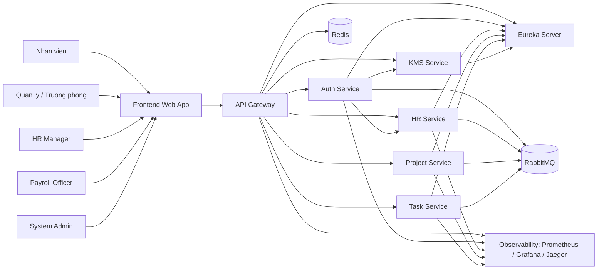

**Hình 3.1:** Mô hình ngữ cảnh hệ thống

Các tác nhân chính bao gồm: **Nhân viên (Employee)**, **Quản lý (Manager)**, **Quản lý Nhân sự (HR Manager)**, **Cán bộ tính lương (Payroll Officer)** và **Quản trị viên (Admin)**. Tất cả các tác nhân này tương tác với hệ thống thông qua ứng dụng web Frontend, sau đó các yêu cầu được định tuyến qua API Gateway đến các dịch vụ Microservices tương ứng. Các thành phần hỗ trợ như Eureka Server, Redis, RabbitMQ và hệ thống giám sát (Observability) cũng được thể hiện để cung cấp cái nhìn tổng quan về môi trường vận hành.

### 3.1.2. Mô hình Container / Dịch vụ (Container / Service Model)

Mô hình Container / Dịch vụ (Hình 3.2) cung cấp cái nhìn chi tiết hơn về các dịch vụ Microservices, cơ sở dữ liệu riêng của chúng và các thành phần hạ tầng hỗ trợ. Mỗi dịch vụ được đóng gói trong một container độc lập, thể hiện rõ nguyên tắc phân rã của kiến trúc Microservices.

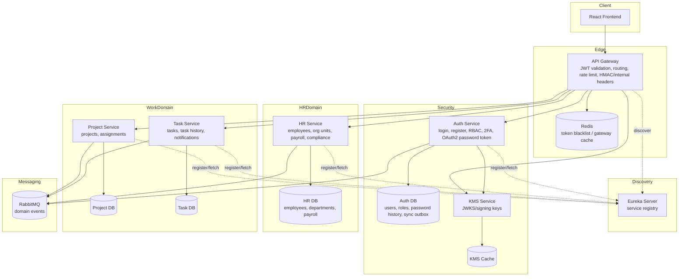

**Hình 3.2:** Mô hình Container / Dịch vụ

**Bảng 3.1: Ma trận trách nhiệm của các dịch vụ (Service Responsibility Matrix)**

| Dịch vụ | Trách nhiệm chính | Dữ liệu sở hữu | Tích hợp |
|---|---|---|---|
| `api-gateway` | Định tuyến API, kiểm tra JWT, cache token bị thu hồi, bổ sung khóa nội bộ, hỗ trợ route tiếng Việt cũ | Không sở hữu dữ liệu nghiệp vụ | KMS JWKS, Redis, Eureka |
| `auth-service` | Đăng ký, đăng nhập, OAuth2 token, 2FA, đổi mật khẩu, khóa/mở tài khoản, quản trị người dùng/vai trò, đồng bộ người dùng sang HR | Người dùng, Vai trò, Lịch sử mật khẩu, Hàng đợi đồng bộ, Hàng đợi lỗi | KMS, endpoint đồng bộ HR, RabbitMQ |
| `hr-service` | Hồ sơ nhân viên, phòng ban, đơn vị tổ chức, bảng lương, quy trình duyệt lương, báo cáo tuân thủ | Nhân viên, Phòng ban, Đơn vị tổ chức, Kết quả lương, Khấu trừ, Cấu hình thuế | Đồng bộ từ Auth, sự kiện RabbitMQ |
| `project-service` | Quản lý dự án, trưởng dự án, phân công nhân viên vào dự án | Dự án, Phân công dự án | Sự kiện dự án qua RabbitMQ |
| `task-service` | Quản lý công việc, trạng thái task, người được giao, lịch sử, thông báo | Công việc, Lịch sử công việc | Sự kiện dự án, bộ gửi thông báo |
| `kms` | Quản lý khóa ký và JWKS cho JWT | Khóa ký, cache khóa | Gateway/Auth |
| `eureka-server` | Đăng ký và khám phá dịch vụ, sao chép registry | Thông tin instance dịch vụ, thông tin thuê bao dịch vụ | Gateway và các service |

## 3.2. Mô hình Use Case

Mô hình Use Case xác định các chức năng mà hệ thống cung cấp và cách các tác nhân tương tác với các chức năng đó. Điều này giúp định nghĩa rõ ràng phạm vi và hành vi của hệ thống.

### 3.2.1. Các tác nhân (Actors)

Các tác nhân trong hệ thống được định nghĩa dựa trên vai trò và quyền hạn của họ, như mô tả trong Bảng 3.2.

**Bảng 3.2: Các tác nhân và vai trò liên quan**

| Tác nhân | Mô tả | Vai trò liên quan |
|---|---|---|
| Nhân viên | Xem dự án/công việc được giao, đổi mật khẩu, đăng nhập/đăng xuất | `USER`, `EMPLOYEE` |
| Quản lý | Theo dõi dự án, xem và quản lý phân công trong phạm vi quản lý | `MANAGER`, `DEPARTMENT_HEAD` |
| Quản lý nhân sự | Quản lý nhân viên, phòng ban, đơn vị tổ chức, xem bảng lương | `HR_MANAGER`, `HR_ADMIN` |
| Cán bộ lương | Phê duyệt, từ chối, xử lý bảng lương | `PAYROLL_OFFICER` |
| Quản trị viên | Quản trị tài khoản, vai trò, dự án, task, cấu hình hệ thống | `ADMIN` |
| Hệ thống ngoài / Scheduler | Gọi sync/retry/event và các tác vụ nền | Internal service |

### 3.2.2. Sơ đồ Use Case (Use Case Diagram)

Sơ đồ Use Case (Hình 3.3) trực quan hóa các chức năng chính của hệ thống và mối quan hệ giữa các tác nhân với các chức năng đó.

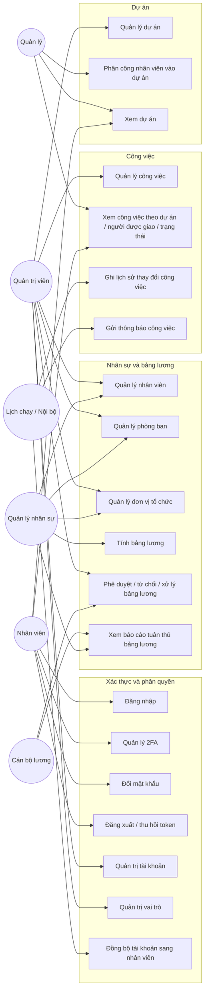

**Hình 3.3:** Sơ đồ Use Case của hệ thống

### 3.2.3. Tóm tắt Use Case (Use Case Summary)

Bảng 3.3 tóm tắt các Use Case chính, mô tả ngắn gọn về hành động kích hoạt (Trigger) và kết quả mong đợi của từng chức năng.

**Bảng 3.3: Tóm tắt các Use Case chính**

| Module | Use case | Trigger | Kết quả |
|---|---|---|---|
| Xác thực | Đăng ký người dùng | Quản trị viên/người dùng gửi tên đăng nhập, mật khẩu, vai trò | Tạo bản ghi người dùng, tạo hàng đợi đồng bộ sang HR |
| Xác thực | Đăng nhập | Tên đăng nhập/mật khẩu/OTP | Trả JWT/OAuth2 token hoặc yêu cầu MFA |
| Xác thực | 2FA | Khởi tạo/xác nhận/tắt 2FA | Cập nhật khóa bí mật và trạng thái 2FA |
| Xác thực | Quản trị người dùng/vai trò | Quản trị viên | Thêm/sửa/xóa người dùng, khóa/mở tài khoản, định nghĩa vai trò |
| Nhân sự | Đồng bộ người dùng | Auth retry/scheduler/internal call | Tạo/cập nhật nhân viên theo mã người dùng Auth/tên đăng nhập/DID, ghi sự kiện đã xử lý |
| Nhân sự | Quản lý nhân viên | HR/Admin | CRUD nhân viên, gán phòng ban, phát sự kiện nhân viên được tuyển dụng |
| Bảng lương | Tính toán bảng lương | HR Admin | Tạo kết quả lương bản nháp theo kỳ lương |
| Bảng lương | Quy trình duyệt lương | Cán bộ lương/Admin | DRAFT -> APPROVED -> PROCESSED hoặc từ chối về DRAFT |
| Dự án | Quản lý dự án | Quản trị viên | CRUD dự án, phát sự kiện khi tạo/thay đổi trạng thái |
| Dự án | Phân công dự án | Quản trị viên/Quản lý | Tạo/xóa phân công dự án theo nhân viên |
| Công việc | Quản lý công việc | Quản trị viên | CRUD công việc, phát sự kiện công việc |
| Công việc | Xem công việc | Người dùng/Quản trị viên | Lọc công việc theo dự án, người được giao, trạng thái |

## 3.3. Mô hình Dữ liệu

Mô hình dữ liệu được thiết kế theo nguyên tắc "Database-per-service", đảm bảo tính độc lập và khả năng mở rộng cho từng Microservice. Phần này trình bày mô hình miền khái niệm (Conceptual Domain Model) và mô hình quan hệ thực thể (ERD) cho từng cơ sở dữ liệu.

### 3.3.1. Mô hình miền khái niệm (Conceptual Domain Model - CDM)

Mô hình miền khái niệm (Hình 3.4) thể hiện các thực thể chính và mối quan hệ logic giữa chúng ở cấp độ cao, không phụ thuộc vào công nghệ cơ sở dữ liệu cụ thể. Các mối quan hệ được biểu diễn là tham chiếu logic qua API/event, không phải khóa ngoại vật lý giữa các cơ sở dữ liệu.

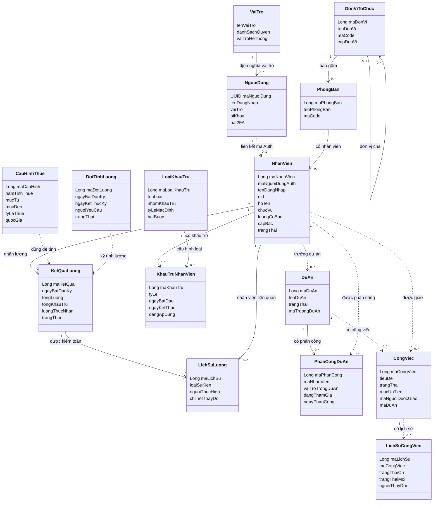

**Hình 3.4:** Mô hình miền khái niệm (Conceptual Domain Model)

**Bảng 3.4: Các Bounded Context và thực thể chính**

| Bounded Context | Aggregate / Thực thể chính | Chú thích |
|---|---|---|
| Xác thực và phân quyền | Người dùng, Vai trò, Lịch sử mật khẩu, Hàng đợi đồng bộ, Hàng đợi lỗi | Nguồn sự thật về tài khoản, vai trò, MFA, mật khẩu |
| Nhân sự lõi | Nhân viên, Phòng ban, Đơn vị tổ chức, Sự kiện đồng bộ đã xử lý | Nguồn sự thật về nhân viên và cơ cấu tổ chức |
| Bảng lương | Đợt tính lương, Kết quả lương, Lịch sử lương, Loại khấu trừ, Khấu trừ nhân viên, Cấu hình thuế | Tính lương, phê duyệt, xử lý, audit |
| Phân bổ dự án | Dự án, Phân công dự án | Quản lý dự án và phân công nhân sự |
| Quy trình công việc | Công việc, Lịch sử công việc | Quản lý công việc, trạng thái, người được giao |
| Khám phá dịch vụ / Gateway | Registry dịch vụ, cache gateway, bảo mật gateway | Hạ tầng, không phải miền nghiệp vụ chính |

### 3.3.2. Mô hình quan hệ thực thể (Entity-Relationship Diagram - ERD) theo từng Database

Các ERD dưới đây minh họa cấu trúc cơ sở dữ liệu cho từng Microservice, tuân thủ nguyên tắc "Database-per-service". Tên bảng và tên cột trong sơ đồ được Việt hóa để phù hợp với báo cáo; khi triển khai trong mã nguồn, schema thật vẫn sử dụng các tên tiếng Anh như `users`, `employees`, `payroll_result`, `projects`, `tasks`.

#### 3.3.2.1. Auth DB

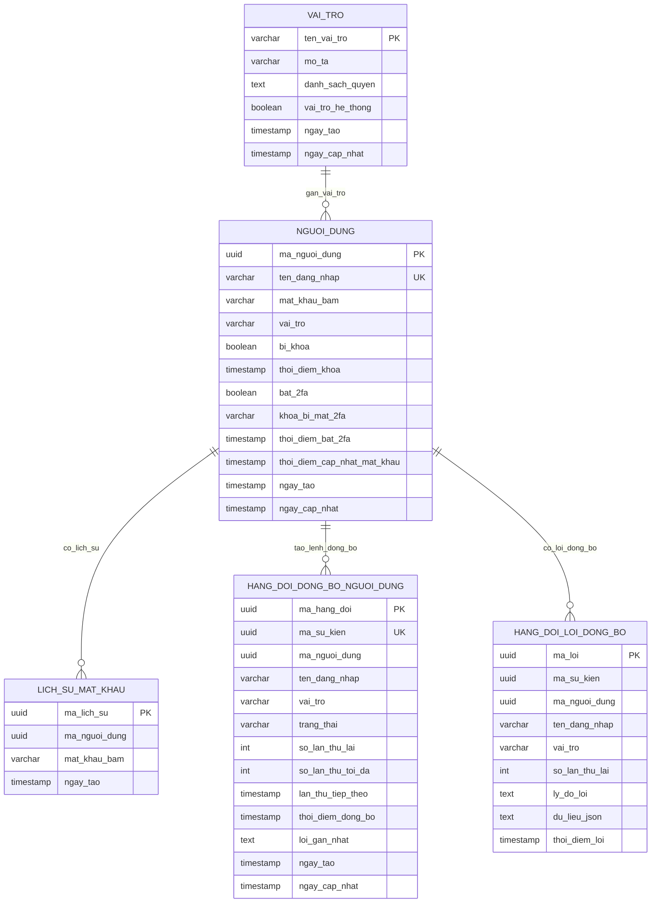

**Hình 3.5:** ERD của Auth DB

#### 3.3.2.2. HR DB

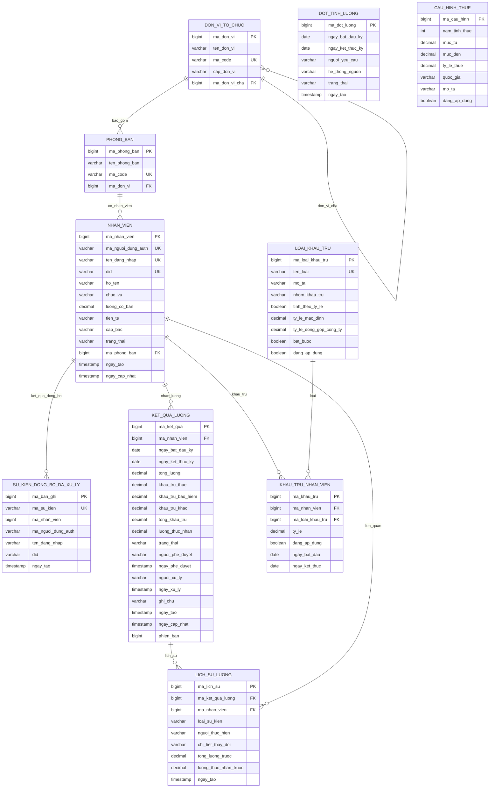

**Hình 3.6:** ERD của HR DB

#### 3.3.2.3. Project DB

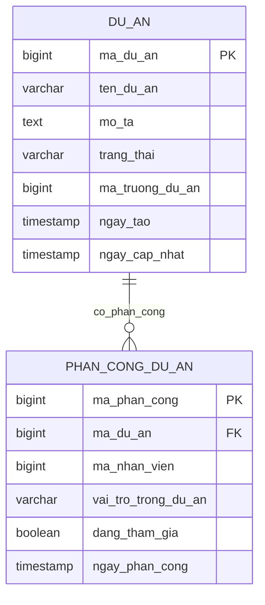

**Hình 3.7:** ERD của Project DB

#### 3.3.2.4. Task DB

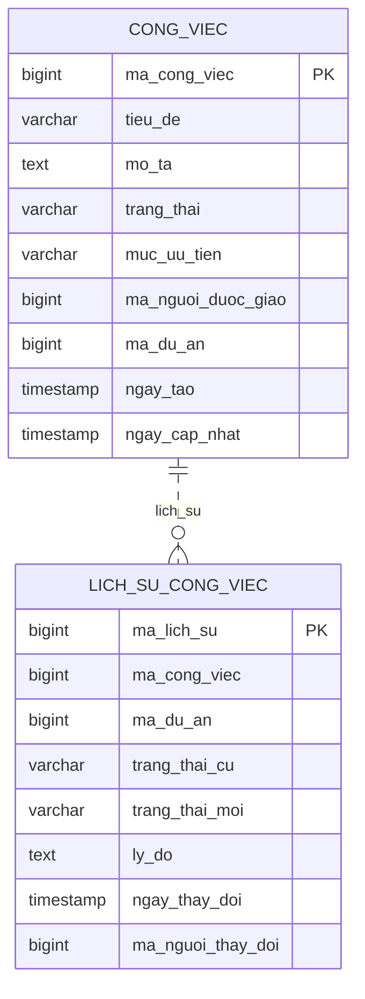

**Hình 3.8:** ERD của Task DB

## 3.4. Luồng xử lý chính (Sequence Models)

Các sơ đồ trình tự (Sequence Diagrams) mô tả luồng tương tác giữa các thành phần trong hệ thống cho các nghiệp vụ quan trọng.

### 3.4.1. Đăng nhập và Gọi API Bảo vệ

Luồng xử lý đăng nhập và gọi API bảo vệ (Hình 3.9) minh họa cách người dùng xác thực và truy cập các tài nguyên được bảo vệ bởi JWT và API Gateway.

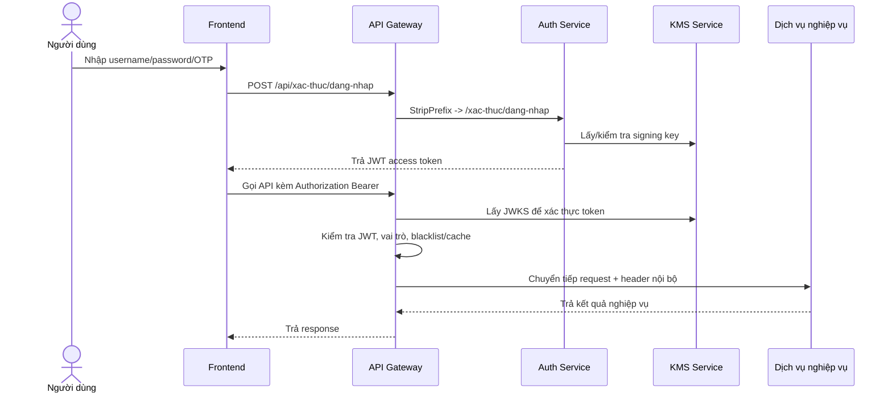

**Hình 3.9:** Luồng xử lý Đăng nhập và Gọi API Bảo vệ

### 3.4.2. Đăng ký User và Đồng bộ Employee

Luồng xử lý đăng ký người dùng và đồng bộ thông tin nhân viên (Hình 3.10) thể hiện cách thông tin người dùng được tạo trong Auth Service và sau đó được đồng bộ sang HR Service.

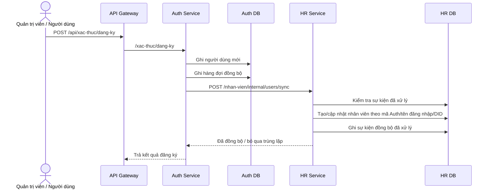

**Hình 3.10:** Luồng xử lý Đăng ký User và Đồng bộ Employee

### 3.4.3. Quy trình duyệt lương (Payroll Workflow)

Quy trình duyệt lương (Hình 3.11 và 3.12) mô tả các trạng thái và luồng tương tác để tính toán, phê duyệt và xử lý bảng lương.

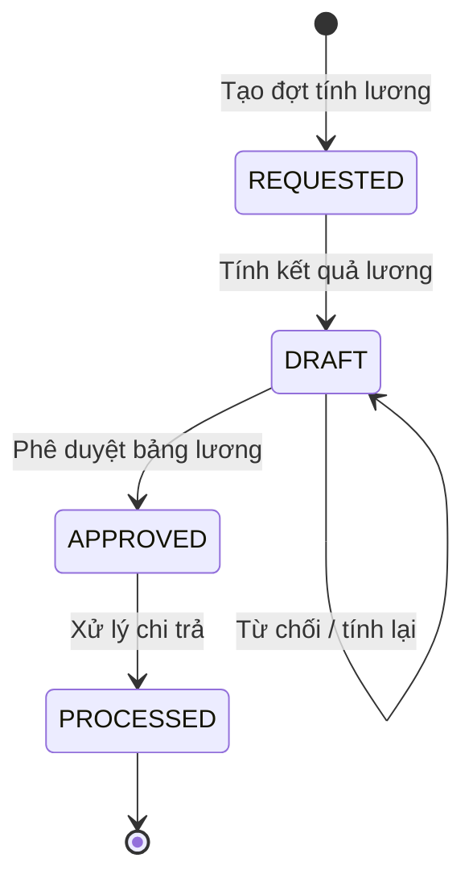

**Hình 3.11:** Sơ đồ trạng thái Quy trình duyệt lương

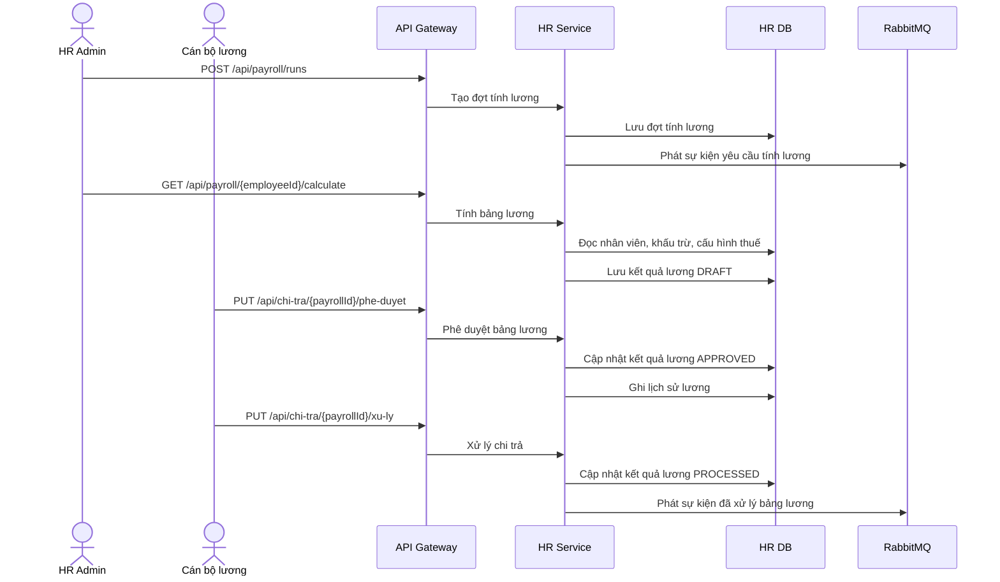

**Hình 3.12:** Luồng xử lý Quy trình duyệt lương

### 3.4.4. Luồng Dự án và Tác vụ (Project and Task Flow)

Luồng xử lý tạo dự án và tác vụ (Hình 3.13) minh họa cách các dự án và tác vụ được tạo và quản lý trong hệ thống.

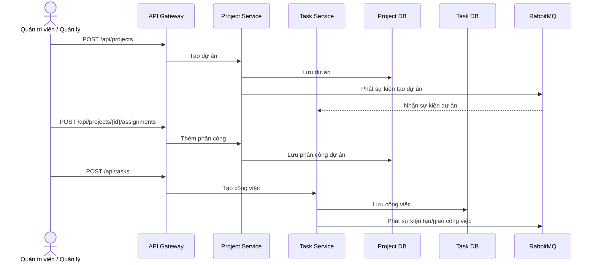

**Hình 3.13:** Luồng xử lý Dự án và Tác vụ

## 3.5. Mô hình Bảo mật và Phân quyền (Security and RBAC Model)

Mô hình bảo mật và phân quyền được thiết kế để đảm bảo tính toàn vẹn, bảo mật và kiểm soát truy cập chặt chẽ cho hệ thống. Cơ chế này được triển khai ở nhiều lớp khác nhau, từ API Gateway đến từng dịch vụ nghiệp vụ.

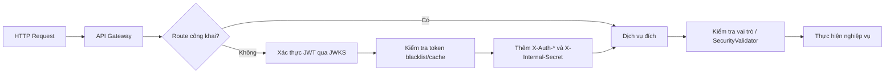

**Hình 3.14:** Luồng xử lý Bảo mật và Phân quyền

**Bảng 3.5: Các lớp áp dụng cơ chế RBAC**

| Lớp | Vị trí | Chức năng |
|---|---|---|
| Gateway JWT | `api-gateway` | Xác thực request bảo vệ, lấy JWKS từ KMS |
| Internal secret | Gateway -> service | Đảm bảo request đi qua gateway |
| Controller role annotation | `@RequiredRoles`, `@RequireRoles`, `@PreAuthorize` | Chặn use case theo vai trò |
| Domain validator | `SecurityValidator` trong HR | Kiểm tra quyền truy cập gateway và vai trò cho payroll/employee |

## 3.6. Ghi chú Thiết kế quan trọng

Các ghi chú dưới đây làm rõ các quyết định thiết kế quan trọng và nguyên tắc được tuân thủ trong quá trình phát triển hệ thống:

*   `auth-service` là nguồn sự thật (Source of Truth) về tài khoản và vai trò người dùng; `hr-service` là nguồn sự thật về thông tin nhân viên.
*   Các liên kết giữa `Employee.authUserId` và `User.id`, `Project.leadId`, `ProjectAssignment.employeeId`, `Task.assigneeId` đều là các tham chiếu logic. Việc không tạo khóa ngoại vật lý giữa các cơ sở dữ liệu khác nhau là một nguyên tắc cốt lõi của kiến trúc Microservices để duy trì tính độc lập dữ liệu.
*   `Task.projectId` tham chiếu logic đến `Project.id`.
*   Quy trình tính lương (Payroll) cần được kiểm toán thông qua bảng `PayrollHistory`; đây được xem là một nhật ký kiểm toán không thể sửa đổi.
*   Việc sử dụng các sự kiện miền (Domain Events) như `EmployeeHiredEvent`, `PayrollProcessedEvent`, `ProjectCreatedEvent`, `TaskCreatedEvent` giúp giảm sự phụ thuộc chặt chẽ (Coupling) giữa các dịch vụ, tăng tính linh hoạt và khả năng mở rộng của hệ thống.
*   `ProcessedSyncEvent` được sử dụng để đảm bảo tính bất biến (Idempotency) khi Auth Service đồng bộ thông tin người dùng sang HR Service, tránh việc tạo trùng lặp dữ liệu trong trường hợp có lỗi hoặc thử lại.

---

# CHƯƠNG 4: TRIỂN KHAI, KIỂM THỬ VÀ KẾT QUẢ BÀN GIAO

## 4.1. Môi trường triển khai kiểm chứng

Để phục vụ giai đoạn báo cáo và bàn giao, hệ thống được đóng gói thành một môi trường demo tối thiểu bằng Docker Compose. Mục tiêu của môi trường này là bảo đảm các luồng nghiệp vụ cốt lõi có thể chạy lại trên cùng một máy phát triển, có dữ liệu mẫu thật và có bằng chứng kiểm thử qua API Gateway.

Các thành phần đã được kiểm chứng trong minimal runtime gồm:

| Thành phần | Vai trò | Cổng kiểm chứng |
|---|---|---|
| API Gateway | Điểm vào duy nhất cho frontend và script kiểm thử | `8080` |
| Auth Service | Đăng nhập, phát hành token và kiểm tra token | `8086` |
| HR Service | Nhân sự và payroll | `8082` |
| Project Service | Dự án và phân bổ thành viên | `8084` |
| Task Service | Quản lý tác vụ | `8087` |
| KMS Service | Khóa/JWKS cho xác thực JWT | `8083` |
| Redis | Cache, blacklist và hỗ trợ kiểm soát truy cập | `6379` |
| PostgreSQL/MySQL | Cơ sở dữ liệu cho từng nhóm service | `5432`, `3306`, `3307` |

Lệnh chạy môi trường bàn giao:

```powershell
.\scripts\run-minimal-demo.ps1
```

Khi cần build lại image trước khi chạy:

```powershell
.\scripts\run-minimal-demo.ps1 -Build
```

Script này khởi động Docker Compose, chờ healthcheck của các service chính và nạp dữ liệu mẫu vào các cơ sở dữ liệu tương ứng.

## 4.2. Dữ liệu mẫu phục vụ demo

Dữ liệu mẫu được chuẩn bị để tránh việc demo bằng màn hình trống hoặc dữ liệu giả phía frontend. Các file seed chính gồm:

| Nhóm dữ liệu | File seed | Nội dung chính |
|---|---|---|
| Auth | `docker/seed/minimal-auth-seed.sql` | Tài khoản demo cho Admin, HR Manager, Payroll Officer, Manager và Employee |
| HR | `docker/seed/minimal-hr-seed.sql` | Đơn vị tổ chức, phòng ban, 13 nhân viên, dữ liệu payroll run/result/history |
| Project/Task | `docker/seed/minimal-business-seed.sql` | 4 dự án, 12 phân công dự án và 14 tác vụ |

Các tài khoản demo dùng trong kiểm thử:

| Username | Vai trò | Mục đích |
|---|---|---|
| `admin` | `ADMIN` | Quản trị và kiểm chứng toàn hệ thống |
| `hr.manager` | `HR_MANAGER` | Quản lý nhân sự và xem nghiệp vụ payroll |
| `payroll.officer` | `PAYROLL_OFFICER` | Phê duyệt, từ chối và xử lý bảng lương |
| `manager` | `MANAGER` | Quản lý dự án và tác vụ |
| `employee` | `USER` | Kiểm chứng luồng người dùng cơ bản |

## 4.3. Kết quả kiểm thử chức năng

Sau khi khởi động lại môi trường Docker minimal, nhóm chạy smoke test qua API Gateway bằng script:

```powershell
.\scripts\smoke-minimal-demo.ps1
```

Kết quả kiểm thử ngày 2026-06-08:

| Hạng mục | Kết quả | Ghi chú |
|---|---|---|
| Gateway health | PASS | Gateway phản hồi healthcheck |
| Login admin | PASS | Đăng nhập qua `/api/xac-thuc/dang-nhap` |
| Token available | PASS | Response có token hợp lệ |
| Validate token | PASS | Kiểm tra token qua gateway |
| HR employees | PASS | Gọi danh sách nhân viên qua gateway |
| Projects | PASS | Gọi danh sách dự án qua gateway |
| Tasks | PASS | Gọi danh sách tác vụ qua gateway |
| Payroll current employee `#4` | PASS | Gọi payroll hiện tại qua gateway |

Tổng kết smoke test: 8/8 hạng mục PASS. Kết quả này chứng minh các luồng tối thiểu gồm đăng nhập, xác thực token, truy cập dữ liệu nhân sự, dự án, tác vụ và payroll đều có thể chạy qua API Gateway.

## 4.4. Kết quả kiểm thử tải đăng nhập

Kiểm thử tải đăng nhập được thực hiện bằng script:

```powershell
.\scripts\load-test-login.ps1 -ConcurrentUsers 3 -TimeoutSeconds 60
```

Để tách bài đo hiệu năng khỏi policy bảo vệ đăng nhập mặc định, minimal runtime được cấu hình riêng:

```text
APP_RATE_LIMIT_LOGIN_LIMIT=120
APP_RATE_LIMIT_LOGIN_WINDOW_SECONDS=60
```

Trong mã nguồn, giá trị mặc định vẫn là `3 request / 5 giây`, còn ngưỡng `120 request / 60 giây` chỉ áp dụng cho môi trường `compose.minimal.yml` khi đo tải.

Kết quả ngày 2026-06-08:

| Mốc tải | Tổng request | Thành công | Lỗi | Tỷ lệ lỗi | Avg | P95 | P99 | Kết luận |
|---:|---:|---:|---:|---:|---:|---:|---:|---|
| 3 user | 3 | 3 | 0 | 0% | 2674.33 ms | 2808 ms | 2808 ms | PASS |
| 50 user | 50 | 45 | 5 | 10% | 13112.1 ms | 31447 ms | 31489 ms | Chưa đạt KPI |
| 100 user | 100 | 57 | 43 | 43% | 20061.41 ms | 30028 ms | 30148 ms | Chưa đạt KPI |

Kết quả trên cho thấy hệ thống xử lý thành công mốc tải nhỏ 3 user đồng thời. Sau khi tách rate-limit cho minimal runtime, Gateway không còn trả lỗi 429 ở mốc 50/100 user, nhưng hệ thống vẫn chưa đạt KPI hiệu năng đăng nhập. Mốc 50 user có tỷ lệ lỗi 10% và P95 khoảng 31.447 giây; mốc 100 user có tỷ lệ lỗi 43% và P95 khoảng 30.028 giây.

Sau các bài tải, smoke test chức năng vẫn PASS 8/8. Điều này cho thấy hệ thống demo không sập sau tải, nhưng đường đăng nhập trong minimal runtime hiện chưa đủ ổn định để kết luận đạt khả năng chịu tải 50/100 user đồng thời. Đây là hạn chế cần ghi rõ trong báo cáo và là cơ sở cho hướng tối ưu tiếp theo.

## 4.5. Kết quả đạt được so với mục tiêu bàn giao

| Mục tiêu bàn giao | Trạng thái | Bằng chứng |
|---|---|---|
| Demo đăng nhập và phân quyền qua gateway | Đạt mức tối thiểu | Login admin và validate token PASS |
| Demo dữ liệu nhân sự thật | Đạt mức API | HR employees PASS, seed HR đã chuẩn bị |
| Demo quản lý dự án/task | Đạt mức API, cần chụp UI | Projects và Tasks PASS |
| Demo payroll tối thiểu | Đạt mức API | Payroll current employee `#4` PASS |
| Có smoke test E2E | Đạt | `smoke-minimal-demo.ps1` PASS 8/8 |
| Có load test đăng nhập | Đạt một phần | Mốc 3 user PASS; mốc 50/100 có số liệu nhưng chưa đạt KPI |
| Có tài liệu bàn giao | Đạt một phần | Đã có runbook, tài khoản demo, script và bảng kết quả; cần bổ sung ảnh màn hình UI cuối |

## 4.6. Hạn chế và hướng hoàn thiện

Các hạn chế còn lại ở thời điểm bàn giao:

*   Mốc kiểm thử tải 50/100 user chưa đạt KPI sau khi đã tách rate-limit cho minimal runtime.
*   Một số luồng UI như tạo dự án, thêm thành viên, tạo task và thao tác payroll đầy đủ vẫn cần được chụp màn hình để làm bằng chứng trực quan trong báo cáo.
*   Môi trường minimal runtime phù hợp demo và kiểm thử bàn giao, nhưng chưa thay thế cho môi trường staging/production đầy đủ có quan sát hệ thống, metric tài nguyên và giám sát dài hạn.

Hướng hoàn thiện tiếp theo:

*   Tiếp tục tách cấu hình rate-limit cho môi trường demo, performance test và production để kết quả kiểm thử tải dễ diễn giải hơn.
*   Tối ưu đường đăng nhập trong `auth-service`, đặc biệt là kết nối PostgreSQL/HikariCP, xử lý Redis và tài nguyên container khi có nhiều request đồng thời.
*   Bổ sung kịch bản E2E UI tự động cho các luồng: đăng nhập, tạo dự án, phân công thành viên, tạo task, tính và duyệt payroll.
*   Ghi nhận thêm metric CPU, RAM, số lượng connection database và log gateway khi chạy tải để đánh giá năng lực hệ thống đầy đủ hơn.
*   Hoàn thiện ảnh minh họa màn hình chính và cập nhật phụ lục bàn giao theo đúng kết quả kiểm chứng cuối cùng.
